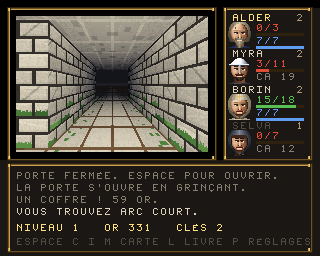

# La Crypte de Faerghail — Amiga 1200 / AmigaOS 3.1+

Un dungeon crawler en vue subjective pour Amiga 1200, écrit en **assembleur
68020** pour `vasm`, lié en exécutable *hunk* par `vlink`, et **entièrement
assemblable depuis Linux ou macOS**.

Création de groupe et règles du SRD D&D 3.5, cinq étages, vingt-six créatures
qui se battent chacune à leur manière, échoppe, pièges, sorts, sauvegarde.
**Huit bitplanes** — 256 couleurs choisies parmi seize millions — un dégradé de
profondeur posé **ligne par ligne par le copper**, un pointeur de souris en
**sprite matériel**, et trois modules **ProTracker** joués sur Paula par un
replayer qui honore vingt-trois de ses effets.



*(capture prise dans un 68020 émulé, palette et copperlist compris — voir
« Ce qui est vérifié ».)*

## Cible

| | |
|---|---|
| Machine | Amiga 1200 (chipset AGA), 68020+ |
| Système | AmigaOS 3.0 / 3.1 et supérieur (`graphics.library` V39) |
| Écran | PAL lores 320×256 |
| Mémoire | 490 Ko de Chip pour les décors et les modules, 175 Ko pour les deux tampons d'écran, 12 Ko de copperlist |
| Audio | 4 voies Paula, module ProTracker cadencé par le VBlank (50 Hz) |

## Compilation

```sh
make toolchain     # télécharge et compile vasm + vlink dans tools/bin (une fois)
make               # produit bin/AGACrawl
```

`make toolchain` récupère les sources de Frank Wille
(<http://sun.hasenbraten.de/vasm/>, <http://sun.hasenbraten.de/vlink/>) et les
compile avec `gcc`. Si `vasmm68k_mot` et `vlink` sont déjà dans votre `PATH`,
`make` les utilise directement.

Régénérer les données (décors, palette, tables, musique, bruitages) :

```sh
make data          # Python 3, réécrit src/sine.i, src/sprite.i, src/palette.i
```

Régénérer la musique, ou l'écouter sans Amiga :

```sh
make wav           # rejoue le module en Python et écrit music.wav
```

Régénérer les données du jeu, et en voir un écran :

```sh
make dungeon       # décors, cartes, police -- vérifie aussi que chaque
                   # niveau a son escalier atteignable depuis le départ
python3 tools/dungeon_preview.py 0 3 1 1 docs/crawl.png
python3 tools/dungeon_preview.py 0 3 1 1 combat.png 2   # ecran de combat
```

Vérifier l'arithmétique du scrolling et la disposition de la copperlist, et
produire un aperçu :

```sh
make check         # rejoue en Python les calculs du code 68k
make preview       # écrit docs/preview.png
```

## Disquette prête à l'emploi

**Trois disquettes** 880 Ko OFS (DOS0, lisibles de Kickstart 1.3 à 3.x) :

| | | |
|---|---|---|
| `dist/Faerghail.adf` | amorçable | le jeu, son `Lisezmoi` et son `Startup-Sequence` |
| `dist/Source.adf` | | tout le source et les tables générées |

À huit bitplanes et dix-neuf apparences de créatures, le jeu pèse 682 Ko —
742 Ko une fois sur l'ADF, où un bloc de 512 n'en porte que 488. Le source,
150 Ko de plus, ne tient pas avec lui. `dist/Faerghail.lha` porte le dépôt
entier en une archive, pour un transfert par réseau, CF ou Gotek.

```sh
make disk          # refabrique les deux -- nécessite pip install amitools
```

- **Émulateur** : montez l'ADF dans DF0: et démarrez dessus.
- **Machine réelle** : écrivez l'ADF sur une disquette (ADF Blitzer,
  X-Copy + Amiga Explorer, Greaseweazle…), ou copiez le `.lha` sur le disque
  dur et faites `lha x Faerghail.lha`.

## Exécution

- **FS-UAE / WinUAE** : configurez une A1200 (Kickstart 3.1, AGA, 68020, 2 Mo
  Chip), montez `dist/Faerghail.adf` dans DF0: et démarrez dessus — ou montez
  le dossier `bin/` comme disque dur et lancez `AGACrawl` depuis le Shell.
- **Machine réelle** : écrivez l'ADF sur une disquette, ou lancez l'exécutable
  **depuis un Shell** (il ne gère pas le message `WBStartup` d'un lancement
  depuis le Workbench).

## Structure

```
src/crawl.s      le jeu : moteur, rendu, combats, magie, interface
src/hardware.i   equates des registres custom et LVO exec/graphics
src/ptreplay.i   replayer ProTracker 4 voies pour Paula, 23 effets

src/tables.i     objets, sorts, monstres, classes, noms          (généré)
src/dgnpal.i     la palette 256 couleurs, en 24 bits            (généré)
src/dgncol.i     le nom et l'étendue de chaque gamme            (généré)
src/artidx.i     indices des morceaux de décor                  (généré)
src/font8.i      police 8x8 de l'interface                      (généré)
src/pointer.i    sprite 0 : le pointeur de souris               (généré)
src/surfgrad.i   le dégradé que le copper pose ligne par ligne  (généré)
data/dgnart.bin  décors en perspective, créatures, portraits    (généré)
data/dgnmap.bin  les cinq étages                                (généré)
data/sfx.bin     quinze bruitages synthétisés                   (généré)
data/crawlmus.mod  la marche du donjon                          (généré)
data/titlemus.mod  la procession de l'écran d'accueil           (généré)
data/deepmus.mod   les profondeurs, à partir du quatrième étage (généré)

tools/palette.py     la palette 256 couleurs, décrite matière par matière
tools/gen_dungeon.py décors, créatures, portraits, cartes, dégradé, pointeur
tools/gen_tables.py  objets, sorts, bestiaire, classes
tools/gen_sfx.py     les bruitages, synthétisés
tools/gen_score.py   les trois musiques
tools/gen_data.py    la police et les tables de base

tools/run68k.py      banc 68020 : charge l'exécutable, émule chipset, souris,
                     clavier, blitter et dos.library
tools/test_game.py   amorçage, création, exploration, combats, échoppe,
                     pièges, souris, fuzz clavier
tools/test_combat.py les capacités des créatures et l'équilibre du gardien
tools/test_layout.py aucun panneau ne déborde ; une icône par type d'objet
tools/test_save.py   sauvegarde, relance, reprise, refus d'une sauvegarde abîmée
tools/test_sfx.py    les bruitages aux registres de Paula, et les trois modules
tools/test_copper.py la copperlist relue instruction par instruction
tools/test_replay.py chaque effet ProTracker jugé au tic près
tools/play_game.py   pilote une partie entière vers les monstres et l'escalier
tools/shot68k.py     photographie les écrans, copperlist comprise
tools/render_mod.py  rejoue un module en Python et écrit un WAV
tools/dungeon_preview.py rend un écran du jeu en PNG sans passer par l'Amiga
tools/make_lha.py    écrit l'archive LhA (et se relit pour se vérifier)

disk/                fichiers écrits à la main pour les disquettes
scripts/make-disk.sh fabrique les ADF et le .lha
scripts/get-toolchain.sh  installation de vasm + vlink
```

## Le jeu — `AGACrawl`

Un crawler dans l'esprit de Black Crypt : on avance case par case, on tourne
de 90°, et le donjon est dessiné en vue subjective.

### Création du groupe

Quatre aventuriers, chacun d'une classe (guerrier, barbare, éclaireur, clerc)
qui décide du dé de vie, de la progression à l'attaque et de l'accès à la
magie. Les six caractéristiques sont tirées **à 4d6 en gardant les trois
meilleurs dés**, comme il se doit ; `R` relance, `ENTRÉE` valide. Le nom se
tape au clavier — et comme le CIA rend des **positions de touches**, pas des
caractères, `TAB` bascule entre AZERTY et QWERTY.

### Règles

Reprises du **SRD 3.5** (le contenu de D&D 3.5 publié sous Open Game
License) — les créatures « Product Identity » qui n'y figurent pas, comme le
beholder ou le flagelleur mental, sont donc absentes :

- **Modificateurs** : `(carac − 10) / 2`, arrondi vers le bas.
- **Classe d'armure** : `10 + mod. Dextérité + armure + bouclier`.
- **Attaque** : `1d20 + bonus de base + mod. Force` contre la CA du monstre.
  Le bonus de base suit le niveau chez les guerriers, les trois quarts
  ailleurs. Un 20 naturel touche toujours et **double les dégâts**.
- **Dégâts** : dés de l'arme + bonus magique + mod. Force. À l'arc, c'est la
  Dextérité qui sert à toucher.
- **Attaques multiples** : une attaque supplémentaire à −5 par tranche de 5
  points de bonus de base, comme la règle d'attaque à outrance.
- **Critiques par arme** : marge et multiplicateur du SRD (19-20/×2 pour les
  épées, ×3 pour les haches et l'arc), avec **jet de confirmation**.
- **Progression d'attaque** : complète, aux trois quarts ou de moitié selon la
  classe.
- **Sauvegardes** : Vigueur, Réflexes, Volonté — `2 + niveau/2` si la
  sauvegarde est forte pour la classe, `niveau/3` sinon, plus le modificateur
  de Constitution, Dextérité ou Sagesse.
- **Points de vie** : dé de classe maximal au niveau 1, puis un jet par
  niveau, plus le mod. Constitution.
- **Magie** : 16 sorts du SRD répartis sur les niveaux 0 à 3, avec
  **emplacements par niveau de sort** suivant la table de progression, plus
  les emplacements bonus de caractéristique. Le degré de difficulté vaut
  `10 + niveau du sort + mod. de lancement`, et les monstres y opposent leurs
  propres sauvegardes — réussie, une boule de feu n'inflige que la moitié des
  dégâts. Les sorts s'apprennent sur des **parchemins**.

### Les huit classes

Guerrier, barbare, roublard, rôdeur, paladin, clerc, magicien, ensorceleur —
chacune avec son dé de vie, sa progression d'attaque, ses sauvegardes fortes
et son type de lanceur (profane sur l'Intelligence, divin sur la Sagesse).

### Le bestiaire dessiné

Vingt-six créatures partageaient **neuf** silhouettes, peintes d'un seul aplat
pris dans la table de compatibilité seize couleurs héritée d'avant l'AGA. Elles
en ont **dix-neuf**, et chacune a du volume : `blob()` et `tube()` éclairent
chaque masse d'en haut à gauche à partir d'une normale approchée, dans une
gamme de la palette — peau, écaille, pourriture, os, mousse, fer, pierre.

C'est le **couple forme + matière** qui fait la créature : le même humanoïde
armé devient orc en peau, homme-lézard en écailles, gnoll en pelage sombre.
Onze formes, dont deux nouvelles pour les créatures qu'on ne confond pas —
l'oursaloup à bec et le minotaure à cornes recourbées.

Deux corrections en passant : les yeux étaient de gros disques cerclés posés
identiquement sur tout le monde, ce qui annulait la variété des silhouettes ;
et les haches étaient des boules répétées, remplacées par un vrai coin dont le
tranchant s'affine et prend la lumière.

**Les morceaux sont recadrés** sur ce qu'ils dessinent (`trim()`), l'abscisse
ramenée sur un multiple de seize pour que les blits restent sans décalage.
Chaque créature occupait un rectangle de 96 × 88 qu'elle ne remplissait pas :
à neuf plans — huit bitplanes et le masque — cela faisait près de dix mille
octets par pose, pour beaucoup de vide. Dix-neuf apparences coûtent maintenant
518 Ko là où neuf en coûtaient 490, et le blitter ne recopie plus les bords
transparents.

### Les créatures, et ce qui les distingue

Vingt-six monstres se battaient tous de la même façon : un jet, des dégâts.
Une goule et un orc, c'était le même combat à un chiffre près. Chacun porte
maintenant un champ de capacités, joué sur les sauvegardes du SRD — Vigueur
contre ce qui attaque le corps, Volonté contre ce qui attaque l'esprit, avec
un DD de 10 + la moitié des dés de vie.

| Capacité | Effet | Qui |
|---|---|---|
| **Poison** | Vigueur, ou 1d3 de Force ; jamais sous 3, rendue au repos | rat sanguin |
| **Paralysie** | Vigueur, ou 1 à 2 tours perdus | goule |
| **Énergie drainée** | Volonté, ou 1d4 points de vie **maximaux**, pour de bon | ombre, ombre blême, spectre |
| **Effroi** | Volonté, ou il n'ose pas frapper ce tour | harpie, momie, spectre |
| **Régénération** | la chair se referme de 4 points par tour | troll, gardien |
| **Peau épaisse** | chaque coup est retenu de 3 points | zombi, gargouille, momie |
| **Seconde attaque** | elle frappe deux fois par tour | loup, worg, minotaure, hydre, oursaloup |

**Le gardien.** L'escalier du dernier étage ne menait dehors qu'en y montant.
Il est désormais gardé : 14 dés de vie, deux attaques par tour, régénération,
effroi. Ses nombres ne sont pas choisis au jugé — `tools/test_combat.py` fait
s'affronter un groupe de niveau sept sans potion ni sort et **compte les
issues**. Trois réglages successifs, tous mesurés :

| Nombres | Le groupe l'emporte | Durée |
|---|---|---|
| CA 22, 2d8+12, peau épaisse **en plus** de la régénération | 1 fois sur 18 | — |
| CA 18, 1d10+6, 149 PV | 31 fois sur 40 | 6,3 rounds |
| **CA 19, 1d10+6, 166 PV** | **51 fois sur 80** | **7,5 rounds** |

Le premier rendait le donjon infinissable sans que rien ne le dise ; le
deuxième en faisait une formalité. Le troisième laisse le groupe gagner deux
fois sur trois — et le groupe qui l'affronte pour de vrai a ses potions et ses
sorts en plus.

Le banc compte désormais **quatre-vingts** duels, pas dix-huit. À dix-huit
l'écart-type vaut deux victoires, à quarante il en vaut trois, et une borne
posée à moins de deux écarts-types de la moyenne se déclenche toute seule :
c'est arrivé, avec « les trois quarts » pour borne haute alors que le groupe
gagne près de deux fois sur trois — le banc criait au loup sur un boss qui
n'avait pas changé. À quatre-vingts duels et des bornes du quart aux quatre
cinquièmes, il reste trois écarts-types de marge de chaque côté.

Le gardien est aussi la seule créature qui ne laisse pas le temps d'une salve :
il barre l'escalier, on lui marche dessus.

### Elles viennent en bande

Un monstre seul, c'est une machine à sous : quatre héros frappent, un monstre
riposte, et la même scène se rejoue trois cents fois. Chaque créature porte
donc un effectif, et c'est son facteur de puissance qui le donne — FP ≤ 1/2 :
jusqu'à quatre ; FP ≤ 2 : jusqu'à trois ; FP ≤ 4 : jusqu'à deux ; au-delà, elle
vient seule. Le kobold arrive à quatre, le troll arrive seul.

Le couloir est étroit : le groupe n'a qu'un adversaire devant lui et le frappe
de toutes ses armes, mais **toute la bande riposte**. Celle de devant tombée,
la suivante s'avance avec ses propres points de vie, et chacune paie son or et
son expérience en tombant.

L'effectif est en outre plafonné par la profondeur — deux au premier étage,
trois au deuxième, puis autant que l'espèce en compte. Sans ce plafond, quatre
kobolds tombaient d'entrée sur un groupe de niveau un à onze points de vie par
tête : `tools/test_game.py` finissait sa deuxième rencontre avec le groupe
anéanti, et tout ce qui suivait — l'échoppe, les pièges, la souris — échouait
en cascade sans qu'aucune de ces épreuves ne soit en cause.

Ce que cela change, mesuré sur les cinq étages, chacun à sa propre profondeur,
avec à chaque palier le groupe qu'on y aurait plausiblement :

| Étage | Le groupe gagne | Ce qu'une rencontre lui coûte |
|---|---|---|
| 1 | 100 % | 2,0 % du groupe |
| 2 | 100 % | 1,9 % |
| 3 | 100 % | 5,9 % |
| 4 | 98 % | 9,5 % |
| 5 | 100 % | 13,4 % |

Une courbe qui monte d'un facteur six et demi, et pas un mur : c'est l'usure
entre deux haltes qui fait le donjon, pas le combat isolé. Huit duels par
espèce et non trois : depuis que l'effectif est tiré au sort, trois ne
mesuraient plus rien — un étage passait de 5 % à 1 % d'une exécution à
l'autre.

**L'approche.** L'arc court existait, et rien ne le distinguait d'une lame : le
rôdeur était un guerrier en moins. Le premier round d'une rencontre se joue
maintenant à distance — seuls l'arc et les sorts portent, la bande ne riposte
pas — puis elle comble le couloir. Une salve d'avance, pas plus : dès qu'une
créature tombe, la suivante s'avance déjà au contact, sinon quatre archers
auraient fauché une bande entière sans jamais être touchés.

**La halte.** `R` dresse le camp sur place : la moitié des points de vie, tous
les emplacements de sorts, le poison dissipé. Une halte sur trois est troublée
— ce qui rôde à cet étage, tiré dans sa propre table de rencontres, tombe sur
un groupe qui n'a rien récupéré. Sans elle le donjon ne se traversait plus :
depuis que les créatures viennent en bande, `tools/play_game.py` voyait le
groupe tomber au deuxième étage faute d'avoir jamais pu souffler, la halte
n'existant qu'entre deux étages.

**Le bandeau de combat.** Le joueur frappait à l'aveugle : il voyait la
créature, jamais ses blessures, et rien ne disait combien elles étaient. Un
bandeau en haut de la vue porte le nom, la jauge des points de vie et le compte
de celles qui restent debout.

### Le bestiaire

26 créatures du SRD, avec leurs statistiques d'origine : kobold, gobelin, rat
sanguin, squelette, orc, hobgobelin, zombi, loup, gnoll, goule, bugbear, worg,
ombre, ogre, homme-lézard, gargouille, oursaloup, harpie, minotaure, troll,
spectre, momie, hydre, géant des collines… plus le gardien. Chaque créature
tire ses propres points de vie à ses dés de vie en se présentant — la seconde
d'une bande n'est pas la copie de la première — et les rencontres sont
réparties par niveau de donjon selon leur facteur de puissance.

### Commandes

| Touche | Effet |
|---|---|
| Flèches | avancer, reculer, tourner |
| Espace | ouvrir une porte, fouiller une niche, entrer à l'échoppe, désamorcer un piège |
| C / I | fiche d'aventure, sac à dos |
| R | camper sur place |
| 1 à 4 | choisir le héros courant |
| A / S / F | attaquer, lancer un sort, fuir (en combat) |
| E / U / D | équiper, utiliser, jeter (dans le sac) |
| M / L / P | carte du niveau, grimoire, réglages |
| Souris | clic gauche : rose des vents dans la vue, choisir un aventurier, poser un curseur ; clic droit : agir, ou refermer un panneau |
| Tab | à l'échoppe : passer de l'achat à la vente |
| ESC | fermer un écran, puis quitter |

### Contenu

Cinq niveaux, 28 objets (11 armes, 5 protections, potions, 6 parchemins,
clés, trésors), 19 apparences de créatures animées sur deux poses, coffres,
objets au sol,
niches creusées dans les murs, portes ordinaires, portes verrouillées — et
une **porte à runes** par niveau, qui pose une énigme à trois réponses :
juste, elle s'efface et le groupe gagne de l'expérience ; faux, la rune brûle
un aventurier.

**Une échoppe par étage.** L'or ramassé dans les coffres et sur les cadavres
ne servait à rien : chaque objet portait pourtant un prix dans `ItemTable`, et
personne ne le lisait. Le marchand est scellé dans un mur comme une niche, à
trois à neuf pas du départ pour qu'on puisse s'équiper avant de s'enfoncer.
Espace ouvre son étal : huit articles choisis pour l'étage, au prix de
l'objet ; Tab passe de l'autre côté du comptoir, où il rachète le butin à
moitié prix. Ce qui est vendu reste vendu — l'étal fait partie de la partie
sauvée.

**Des dalles piégées**, quatre au premier étage, huit au dernier. Elles ne se
voient pas. En marchant dessus, chaque aventurier debout tente un jet contre
DD 14 + 2 × étage : le roublard ajoute son niveau et 4, les autres se
contentent de leur sagesse et d'un tiers de leur niveau. Repérée, la dalle
est marquée d'une croix à la craie et le groupe s'arrête net ; Espace tente
de la désamorcer, ce qui rapporte de l'expérience à tout le monde et, raté de
plus de 5, la fait sauter. Non repérée, elle se détend : jet de Réflexes (de
Vigueur pour le nuage acide), un dé de dégâts par étage plus un, moitié moins
si la sauvegarde passe. Un ressort ne sert qu'une fois — la dalle redevient
du dallage.

Le générateur **vérifie que chaque niveau reste finissable** : il place les
serrures loin du départ et les clés près, puis contrôle par parcours en
largeur qu'on atteint l'escalier ou au moins une clé sans forcer une serrure.
Ce contrôle a déjà attrapé un niveau coupé en deux dès la deuxième case.

### La souris

Le pointeur est un **sprite matériel** — sprite 0, seize pixels de côté, quatre
couleurs. Il ne coûte rien : ni blit, ni sauvegarde de fond, ni redessin. Ses
couleurs viennent du bloc `$f0`, que `BPLCON4` (ESPRM/OSPRM = `$f`) lui réserve
et qu'aucune teinte du décor n'occupe.

`JOY0DAT` ne donne pas une position mais deux compteurs de huit bits qui
tournent en rond : on lit une différence par trame, en étendant le signe du
huitième bit — sans quoi un pas vers la gauche se lirait comme un bond de 255
pixels vers la droite. Le bouton gauche est le bit 6 de `CIAAPRA`, le droit le
bit 10 de `POTGOR`, tous deux à zéro quand ils sont enfoncés.

Un clic ne double pas la logique du clavier : il se traduit en touche et repart
dans `HandleKey`. Dans la vue, la souris dessine une rose des vents en trois
colonnes et trois rangées — avancer, reculer, tourner, agir au centre ; en
combat, cliquer c'est frapper. Sur le panneau du groupe, un clic choisit
l'aventurier de ce bloc. Dans une liste — sac, échoppe, grimoire, réglages —
il pose le curseur sur la ligne visée, et un second clic sur la même ligne
conclut. Le bouton droit referme un panneau ; dans la vue il agit, plutôt que
de quitter le jeu par mégarde.

### Rendu

Aucun calcul 3D à l'exécution : les murs sont pré-calculés en perspective par
`tools/gen_dungeon.py` — un morceau par position, y compris le fond et le mur
extérieur des passages latéraux — et posés au blitter du plus loin au plus
proche, en cookie-cut (minterme `$CA`) et **sans décalage**, puisque la
géométrie est fixe et chaque morceau calé sur un mot. Les murs latéraux se
projettent en droites passant par le point de fuite : à la colonne `x`, la
distance vaut `64/|96−x|`, ce qui donne un placage de texture exact. Les
dalles du sol et du plafond suivent la même règle. La pierre a son grain, ses
fissures et sa mousse, tirés d'un bruit stable.

Écran 320×256 en **8 bitplanes** — 256 couleurs choisies parmi seize millions,
la palette chargée en 24 bits (`BPLCON3` LOCT, huit banques de trente-deux),
double tampon ; l'affichage n'est refait qu'après une action.

### Le copper : plus de couleurs que la palette n'en tient

La gamme de pierre compte vingt teintes. Sur les cinquante-sept lignes qui
séparent l'horizon du bord de l'écran, la profondeur s'y lisait donc en vingt
marches, et le dallage montrait des bandes.

Le sol et la voûte ne portent plus leur profondeur dans la palette : ils ne
gardent que leur **variation locale** — joint de terre, usure du passage,
mousse, suie, nervure, extinction latérale — codée sur douze cases,
`$f4`–`$ff`. Le copper réécrit ces douze cases **toutes les deux lignes** avec
la profondeur de la ligne, calculée sur la même loi de lumière que les murs.
Il y a donc **68 profondeurs à l'écran là où la palette n'en tient que vingt**,
et les douze cases ne coûtent rien au reste du décor.

Ces douze cases tombent dans le bloc `$f0` que `BPLCON4` donne aux sprites,
dont ceux-ci n'utilisent que les quatre premières : le matériel lit les mêmes
registres, chacun n'y regarde que ce qui le concerne.

Le coût : 26 instructions copper par bloc, soit **28 cycles couleur par ligne
sur 227**. `tools/test_copper.py` relit la liste construite et le vérifie.

**La flamme.** Six degrés de clarté sont préparés à la génération ; à chaque
trame le jeu passe de l'un à l'autre par une marche au hasard bornée et
centrée, en recopiant 1 632 mots dans la copperlist juste après le retour
trame. Le décor ne bouge pas d'un pixel — seule la lumière respire.

### Son

Deux modules ProTracker quatre voies, tous deux en ré mineur : la procession
de l'écran d'accueil et la marche du donjon. Quatorze instruments synthétisés
— timbale, taïko, cymbale, bourdon, cor, chœur, cordes, harpe, orgue, fifre,
viole, cloche, gong, tambour. La quatrième voie est **empruntée** le temps
d'un bruitage (épée, hache, arc, impact, esquive, porte, coffre, potion, sort,
rugissement, montée de niveau, pas, mort, piège, pièces), le replayer laissant
le canal tranquille pendant la durée indiquée dans la table.

**Le replayer honore 23 des effets de ProTracker**, contre neuf auparavant :

| | |
|---|---|
| Hauteur | `0xy` arpège, `1xx`/`2xx` glissandos, `3xx` portamento vers la note, `4xy` vibrato, `E1x`/`E2x` glissandos fins |
| Volume | `Cxx`, `Axy` glissement, `7xy` trémolo, `EAx`/`EBx` glissement fin, `ECx` coupure |
| Combinés | `5xy` portamento + volume, `6xy` vibrato + volume |
| Déclenchement | `9xx` départ dans le sample, `E9x` relance, `EDx` note retardée |
| Structure | `Bxx` saut, `Dxx` break, `Fxx` vitesse, `E6x` boucle de motif, `EEx` ligne retenue |
| Matériel | `E0x` filtre passe-bas (la diode) |

Manquent `E3x` (glissando), `E4x`/`E7x` (choix de forme d'onde), `E5x`
(finetune) et `EFx` (inversion de boucle) : les samples étant synthétisés sans
table de finetune, ils n'auraient rien à modifier.

Les partitions s'en servent : vibrato sur les tenues du cor et du chœur,
trémolo lent sous le bourdon, roulement de tambour par relance plutôt que
réécrit ligne par ligne, coups doubles par note retardée, cymbale prise après
son attaque par `9xx`, cadence élargie par `EEx`.

Le replayer est écrit **deux fois** — en 68k dans `src/ptreplay.i`, en Python
dans `tools/render_mod.py` — à partir de la même lecture du format. Quand les
deux divergent, l'une a tort, et `tools/test_replay.py` dit laquelle : il écrit
de vrais motifs dans le module chargé, appelle `PT_Tick` tic par tic, et lit ce
qui part vers `AUDxPER`, `AUDxVOL`, `AUDxLC` et `DMACON`.

Le module perdait des tics pendant les déplacements : un redessin complet dure
plus qu'une image, et le tic n'était appelé qu'une fois par tour de boucle.
`MusicPoll`, semé dans les traitements longs, rejoue un tic dès qu'une image
s'est écoulée — le tempo tient désormais pendant le rendu.

## Points techniques — musique (`src/ptreplay.i`)

**Cadence.** `PT_Tick` est appelé une fois par image depuis la boucle
principale, juste après l'échange de copperlist : le VBlank sert d'horloge
(50 Hz), et `Fxx` règle le nombre de ticks par ligne (6 par défaut). Pas
d'interruption de niveau 3, donc pas de vecteur à installer ni de passage en
mode superviseur — en contrepartie, une image trop longue ralentirait la
musique.

**La séquence que Paula impose** pour lancer une note, et qui est la source
d'erreur classique :

1. couper le DMA du canal ;
2. écrire `AUDxLC`, `AUDxLEN`, `AUDxPER`, `AUDxVOL` ;
3. attendre deux lignes raster, le temps que Paula constate l'arrêt ;
4. relancer le DMA ;
5. **au tick suivant seulement**, écrire le point de boucle dans `AUDxLC` /
   `AUDxLEN` — Paula a alors déjà chargé l'adresse de départ, et rebouclera
   sur la boucle du sample.

**Le module doit être en Chip RAM** : `incbin` dans une section `DATA_C`, ce
que l'on vérifie sur le fichier lié (le hunk du module porte bien le drapeau
CHIP). Le filtre passe-bas est coupé au démarrage (`bset #1,$BFE001`, le bit
de la LED) et remis dans son état d'origine à la sortie.

**Effets implémentés** : vingt-trois des trente de ProTracker — voir le
tableau de la section « Son ». Manquent `E3x`, `E4x`/`E7x`, `E5x` et `EFx` :
les samples étant synthétisés sans table de finetune, ils n'auraient rien à
modifier.

**Les modules sont synthétisés** par `tools/gen_score.py` — quatorze
instruments (timbale, taïko, cymbale, bourdon, cor, chœur, cordes, harpe,
orgue, fifre, viole, cloche, gong, tambour) et trois partitions en ré mineur.
Rien n'est emprunté à un module existant, le dépôt reste libre de droits.

## Ce qui est vérifié, et ce qui ne l'est pas

Le jeu n'a jamais tourné sur une vraie machine. Il tourne en revanche **pour de
bon** dans un 68020 émulé : `tools/run68k.py` charge l'exécutable *hunk*, le
relocalise, remplace `exec` et `graphics` par des souches, et émule le
balayage vidéo, le blitter, le CIA du clavier, les compteurs de la souris et
`dos.library`. Neuf bancs font avancer **le vrai binaire** et relisent son état
en mémoire :

| Banc | Ce qu'il éprouve |
|---|---|
| `test_game.py` | amorçage, création, exploration, combats, échoppe, pièges, souris, 800 touches au hasard |
| `test_combat.py` | les sept capacités des créatures, les bandes, la halte, l'équilibre du gardien, la courbe des cinq étages |
| `test_lore.py` | les onze pages du journal, les stèles des cinq étages, l'introduction et les deux fins |
| `test_layout.py` | aucun panneau ne déborde du cadre ; le bandeau de combat et sa jauge ; une icône par type d'objet |
| `test_save.py` | sauvegarde → relance → reprise, et refus d'une sauvegarde abîmée |
| `test_sfx.py` | quinze bruitages aux registres de Paula, et la bonne partition à chaque moment |
| `test_copper.py` | la copperlist relue instruction par instruction |
| `test_replay.py` | chaque effet ProTracker jugé au tic près sur `AUDxPER`/`AUDxVOL`/`AUDxLC` |
| `play_game.py` | un parcours dirigé complet, des monstres à l'escalier, avec haltes |

À la génération, `tools/gen_dungeon.py` vérifie par parcours en largeur que
l'escalier de chaque étage est atteignable, que chaque levier s'atteint sans
franchir la herse qu'il commande, et que l'échoppe se laisse aborder.
`tools/render_mod.py` rejoue les modules avec la même sémantique que le
replayer 68k et produit un WAV — le replayer est ainsi écrit deux fois, et
quand les deux divergent le banc dit laquelle a tort.

Ces bancs ne sont pas décoratifs. Ils ont trouvé une courbe d'expérience qui
donnait le niveau 11 après dix combats, des dégâts de monstre jamais
appliqués, un jeu ingagnable par attrition, six sorts inatteignables, un
gardien qui gagnait dix-sept fois sur dix-huit, quatre kobolds qui anéantissaient
d'entrée un groupe de niveau un, des capacités spéciales
branchées dans une branche morte, une potion qui montrait un parchemin, du
texte qui changeait de couleur sur tout fond non noir, une `dbf` qui bouclait
65 536 fois — et, plus embarrassant, plusieurs bancs qui *mesuraient la
mauvaise chose* et annonçaient « aucune anomalie » sur des mécaniques inertes.

**Ce qui n'est pas vérifié** : le comportement réel du chipset. Le harnais
émule ce dont le code a besoin pour avancer — le balayage, le blitter, Paula
en écriture — mais ni les temps d'accès mémoire, ni le recouvrement DMA, ni
ce que le copper fait réellement du milieu d'une ligne. Une machine réelle
reste le seul juge de la fluidité.

## Pistes pour la suite

- Charger les décors depuis la disquette plutôt que par `incbin` : l'exécutable
  fait 682 Ko, dont 538 de données. Un chargeur permettrait de répartir le
  contenu sur plusieurs disquettes.
- Interruption niveau 3 (VERTB) plutôt qu'une attente active.
- Cadencer le replayer par une interruption CIA-B (tempo BPM réel) plutôt que
  par le VBlank.
