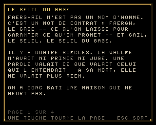
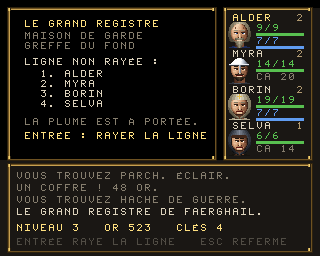

# Un jeu et deux démos AGA — Amiga 1200 / AmigaOS 3.1+

Trois programmes 68k **entièrement assemblables depuis Linux ou macOS**, écrits
en assembleur Motorola pour `vasm`, liés en exécutables *hunk* Amiga par
`vlink`.

| Programme | Contenu |
|---|---|
| `bin/AGACrawl` | **La Crypte de Faerghail** — dungeon crawler façon Black Crypt : création de groupe et règles inspirées de D&D 3.5, inventaire, magie, objets, niches, monstres animés, bruitages |
| `bin/AGADemo` | dégradé plein écran généré **ligne par ligne par le copper en 24 bits réels**, plus une boule en **sprite matériel** |
| `bin/AGAScroll` | playfield **8 bitplanes (256 couleurs 24 bits)** de 640×384 pixels en **scrolling 100 % matériel**, plus un **scroller de texte sinusoïdal** au blitter dans une bande séparée |

Tous jouent un **module ProTracker 4 voies sur Paula**. Les démos se quittent
par le bouton gauche de la souris, le jeu par ESC.


*(images produites par les modèles Python `tools/dungeon_preview.py` et
`tools/preview.py` — voir plus bas.)*

## Cible

| | |
|---|---|
| Machine | Amiga 1200 (chipset AGA), 68020+ |
| Système | AmigaOS 3.0 / 3.1 et supérieur (`graphics.library` V39) |
| Écran | PAL lores 320×256 |
| Mémoire | `AGADemo` : quelques Ko de Chip — `AGAScroll` : 240 Ko de Chip pour le bitmap, plus 8 Ko de copperlists ; le module (7,5 Ko) est en Chip dans les deux |
| Audio | 4 voies Paula, module ProTracker cadencé par le VBlank (50 Hz) |

## Compilation

```sh
make toolchain     # télécharge et compile vasm + vlink dans tools/bin (une fois)
make               # produit bin/AGADemo et bin/AGAScroll
```

`make toolchain` récupère les sources de Frank Wille
(<http://sun.hasenbraten.de/vasm/>, <http://sun.hasenbraten.de/vlink/>) et les
compile avec `gcc`. Si `vasmm68k_mot` et `vlink` sont déjà dans votre `PATH`,
`make` les utilise directement.

Régénérer les données (table sinus, pixels du sprite, palette 256 couleurs) :

```sh
make data          # Python 3, réécrit src/sine.i, src/sprite.i, src/palette.i
```

Régénérer la musique, ou l'écouter sans Amiga :

```sh
make music         # réécrit data/music.mod (samples et partition synthétisés)
make wav           # rejoue le module en Python et écrit music.wav
```

Régénérer les données du jeu, et en voir un écran :

```sh
make dungeon       # décors, cartes, police -- vérifie aussi que chaque
                   # niveau a son escalier atteignable depuis le départ
python3 tools/dungeon_preview.py 0 3 1 1 docs/crawl.png
python3 tools/dungeon_preview.py 0 3 1 1 combat.png 2   # ecran de combat
```

Vérifier l'arithmétique du scrolling et la disposition de la copperlist, et
produire un aperçu :

```sh
make check         # rejoue en Python les calculs du code 68k
make preview       # écrit docs/preview.png
```

## Disquette prête à l'emploi

`dist/AGADemos.adf` est une disquette 880 Ko **OFS amorçable** (DOS0, lisible
de Kickstart 1.3 à 3.x) contenant les trois exécutables, le source des deux
démos et les trois fichiers écrits à la main dont le jeu dépend, un
`Lisezmoi.txt` et un `S/Startup-Sequence` qui lance le jeu au démarrage.

Elle ne peut plus tout porter : à huit bitplanes le jeu pèse à lui seul plus
d'un demi-mégaoctet — six cent mille octets une fois sur la disquette, où un
bloc de 512 n'en porte que 488 — et les trois programmes en occupent six cent
quarante mille sur huit cent quatre-vingt. **`crawl.s` ne tient plus** : cent
quarante-huit mille octets, trois cents blocs, et il n'en reste pas dix. Le
script écrit donc ce qui rentre, dans un ordre fixé, et dit ce qu'il laisse.

Le reste — `crawl.s`, les données générées, et les tables en `dc.w` dont
`surfgrad.i` qui pèse à lui seul quatre-vingt mille octets — vit dans
**`dist/AGADemos.lha`**, qui porte tout. Les générateurs Python refont les
tables en une seconde.

```sh
make disk          # refabrique les deux -- nécessite pip install amitools
```

- **Émulateur** : montez l'ADF dans DF0: et démarrez dessus.
- **Machine réelle** : écrivez l'ADF sur une disquette (ADF Blitzer,
  X-Copy + Amiga Explorer, Greaseweazle…), ou copiez le `.lha` sur le disque
  dur et faites `lha x AGADemos.lha`.

## Exécution

- **FS-UAE / WinUAE** : configurez une A1200 (Kickstart 3.1, AGA, 68020, 2 Mo
  Chip), montez le dossier `bin/` comme disque dur, puis depuis le Shell :
  `AGADemo`.
- **Machine réelle** : copiez les exécutables et lancez-les **depuis un Shell**
  (ils ne gèrent pas le message `WBStartup` d'un lancement depuis le Workbench).

## Structure

```
src/demo.s       démo 1 : prise de contrôle, dégradé copper 24 bits, sprite
src/scroll.s     démo 2 : 8 bitplanes AGA + scrolling matériel
src/hardware.i   equates des registres custom et LVO exec/graphics
src/sine.i       table sinus 256 entrées                    (généré)
src/sprite.i     boule 16×16, 2 plans                       (généré)
src/palette.i    256 couleurs 24 bits (hauts / bas)         (généré)
src/font.i       police 16x16 pour le scrolltext             (généré)
src/crawl.s      le jeu : moteur, rendu, combats, magie, interface
src/tables.i     objets, sorts, monstres, classes, noms          (généré)
data/sfx.bin     bruitages synthétisés                           (généré)
src/dgnpal.i     palette 16 couleurs du donjon               (généré)
src/font8.i      police 8x8 de l'interface                   (généré)
data/dgnart.bin  décors en perspective et monstres           (généré)
data/dgnmap.bin  les trois niveaux                           (généré)
src/ptreplay.i   replayer ProTracker 4 voies pour Paula
src/vblank.i     interruption de retour trame (niveau 3, VERTB)
data/music.mod   module ProTracker, samples et partition     (généré)
tools/gen_data.py    générateur des quatre .i de données
tools/gen_module.py  générateur du module ProTracker
tools/gen_dungeon.py générateur des décors, des cartes et de la police 8x8
tools/gen_tables.py  générateur des tables du jeu
tools/gen_sfx.py     générateur des bruitages
tools/dungeon_preview.py rend un écran du jeu en PNG et contrôle les données
tools/render_mod.py  rejoue le module en Python et écrit un WAV
tools/preview.py     modèle Python du pipeline de scroll.s : contrôles + aperçu
tools/make_lha.py    écrit l'archive LhA (et se relit pour se vérifier)
tools/run68k.py      banc 68020 : charge l'exécutable, émule chipset et clavier
tools/test_game.py   fait tourner le jeu et contrôle ses invariants
tools/play_game.py   pilote le jeu vers les monstres, les objets, l'escalier
tools/shot68k.py     photographie les écrans dessinés par le processeur émulé
tools/test_sfx.py    vérifie les bruitages aux registres de Paula
tools/test_layout.py vérifie qu'aucun panneau ne déborde de la vue
tools/gen_score.py   générateur des deux musiques (accueil et donjon)
tools/palette.py     la palette 256 couleurs AGA, décrite matière par matière
tools/test_save.py   accueil, sauvegarde et reprise, fichiers à l'appui
tools/test_layout.py contrôle qu'aucun panneau ne déborde de la vue
docs/histoire.md     le fond de fiction : ce qu'était Faerghail
disk/                fichiers écrits à la main pour la disquette
scripts/make-disk.sh fabrique l'ADF amorçable et le .lha
scripts/get-toolchain.sh  installation de vasm + vlink
```

## Le jeu — `AGACrawl`

Un crawler dans l'esprit de Black Crypt : on avance case par case, on tourne
de 90°, et le donjon est dessiné en vue subjective.

### L'histoire

La crypte a un fond, écrit dans [docs/histoire.md](docs/histoire.md).

`Faerghail` n'est pas un nom d'homme mais un mot de contrat : **faergh**, le
gage, et **gail**, le seuil. *Le seuil du gage.* C'était une **maison de
garde** — l'endroit où, faute de juge et de prince, on descendait déposer un
objet pour garantir une promesse, et où un greffier tenait le registre des
échéances. Trois étages, un par génération de greffiers, creusés dans une
ancienne carrière de schiste : d'où la forme du lieu, qui n'est ni un tombeau
ni un donjon de guerre mais un **classement**, et d'où la sortie tout en bas,
là où la carrière débouche sur la vallée.

Le fond n'a pas été inventé à côté du jeu, mais à partir de lui : chaque règle
déjà écrite y trouve sa raison.

| Ce que le jeu fait | Pourquoi la maison le fait |
|---|---|
| Le grand registre, au fond du dernier étage | C'est un greffe : la maison tient ses comptes, et la ligne se raye là où elle est écrite |
| Les quatre noms du groupe y font les quatre colonnes | Une quittance porte quatre signatures |
| La sortie ne s'ouvre qu'une fois la ligne rayée | On ne sort de Faerghail qu'acquitté |
| Un marchand scellé dans un mur, un par étage | L'emmurement de garde du dernier greffier : il est devenu une clause de la maison, et un guichet est un endroit, pas un homme |
| Il rachète à moitié prix | Le taux d'un dépôt refait |
| Une porte à runes par étage, **trois** réponses | Le contrôle par question — une clé se vole, pas une réponse — et les trois colonnes du registre |
| Une réponse fausse brûle un aventurier | La rune ne punit pas : elle inscrit |
| Des dalles piégées, deux fois plus en bas | Une dette impayée, un ressort tendu ; en bas, les échéances sont plus vieilles |
| Une dalle ne se déclenche qu'une fois | Le ressort détendu, le compte est soldé |
| Une croix à la craie sur la dalle repérée | La marque des greffiers, sur un compte à examiner |
| Quatre aventuriers, ni trois ni cinq | Quatre colonnes de signature au bas d'une quittance |
| La sortie est tout en bas | La gueule de la carrière, devenue porte des quittances |

Dans le jeu, cela se lit à l'accueil — **touche 3**, quatre pages tournées à
n'importe quelle touche, les flèches pour revenir, `ESC` pour ressortir ; la
page d'après la dernière rend l'accueil, pour qui lit sans regarder les
touches. Et cela affleure en jouant : la ligne d'ouverture, une inscription
par étage dans le journal, la voix derrière le mur à l'échoppe, et la
quittance en guise de victoire — **on ne sort de Faerghail qu'acquitté**.



Les quatre pages sont des listes de lignes terminées par un long nul : on en
ajoute une sans rien recompter, et la dernière page ne demande pas de cas
particulier. Une ligne marquée d'une étoile passe à l'or — il n'y en a
qu'une. `PROLOGROWS` borne le dessin à ce que le cadre tient : une ligne de
trop déborderait du plan et retomberait en haut du suivant, ce que
`tools/test_layout.py` va justement chercher, page par page, en regardant la
bordure de l'écran et la bande laissée entre le texte et le pied de page.

### Création du groupe

Quatre aventuriers, chacun d'une classe (guerrier, barbare, éclaireur, clerc)
qui décide du dé de vie, de la progression à l'attaque et de l'accès à la
magie. Les six caractéristiques sont tirées **à 4d6 en gardant les trois
meilleurs dés**, comme il se doit ; `R` relance, `ENTRÉE` valide. Le nom se
tape au clavier — et comme le CIA rend des **positions de touches**, pas des
caractères, `TAB` bascule entre AZERTY et QWERTY.

### Règles

Reprises du **SRD 3.5** (le contenu de D&D 3.5 publié sous Open Game
License) — les créatures « Product Identity » qui n'y figurent pas, comme le
beholder ou le flagelleur mental, sont donc absentes :

- **Modificateurs** : `(carac − 10) / 2`, arrondi vers le bas.
- **Classe d'armure** : `10 + mod. Dextérité + armure + bouclier`.
- **Attaque** : `1d20 + bonus de base + mod. Force` contre la CA du monstre.
  Le bonus de base suit le niveau chez les guerriers, les trois quarts
  ailleurs. Un 20 naturel touche toujours et **double les dégâts**.
- **Dégâts** : dés de l'arme + bonus magique + mod. Force. À l'arc, c'est la
  Dextérité qui sert à toucher.
- **Attaques multiples** : une attaque supplémentaire à −5 par tranche de 5
  points de bonus de base, comme la règle d'attaque à outrance.
- **Critiques par arme** : marge et multiplicateur du SRD (19-20/×2 pour les
  épées, ×3 pour les haches et l'arc), avec **jet de confirmation**.
- **Progression d'attaque** : complète, aux trois quarts ou de moitié selon la
  classe.
- **Sauvegardes** : Vigueur, Réflexes, Volonté — `2 + niveau/2` si la
  sauvegarde est forte pour la classe, `niveau/3` sinon, plus le modificateur
  de Constitution, Dextérité ou Sagesse.
- **Points de vie** : dé de classe maximal au niveau 1, puis un jet par
  niveau, plus le mod. Constitution.
- **Magie** : 16 sorts du SRD répartis sur les niveaux 0 à 3, avec
  **emplacements par niveau de sort** suivant la table de progression, plus
  les emplacements bonus de caractéristique. Le degré de difficulté vaut
  `10 + niveau du sort + mod. de lancement`, et les monstres y opposent leurs
  propres sauvegardes — réussie, une boule de feu n'inflige que la moitié des
  dégâts. Les sorts s'apprennent sur des **parchemins**.

### Les huit classes

Guerrier, barbare, roublard, rôdeur, paladin, clerc, magicien, ensorceleur —
chacune avec son dé de vie, sa progression d'attaque, ses sauvegardes fortes
et son type de lanceur (profane sur l'Intelligence, divin sur la Sagesse).

### Le bestiaire

25 créatures du SRD, avec leurs statistiques d'origine : kobold, gobelin, rat
sanguin, squelette, orc, hobgobelin, zombi, loup, gnoll, goule, bugbear, worg,
ombre, ogre, homme-lézard, gargouille, oursaloup, harpie, minotaure, troll,
spectre, momie, hydre, géant des collines… Chaque monstre tire ses points de
vie à ses dés de vie à l'apparition, et les rencontres sont réparties par
niveau de donjon selon leur facteur de puissance.

### Commandes

À l'accueil : `1` commence une partie, `2` reprend la partie sauvée, `3`
ouvre le prologue, `ESC` quitte.

| Touche | Effet |
|---|---|
| Flèches | avancer, reculer, tourner |
| Espace | ouvrir une porte, fouiller une niche, entrer à l'échoppe, lire le grand registre, désamorcer un piège |
| C / I | fiche d'aventure, sac à dos |
| 1 à 4 | choisir le héros courant |
| A / S / F | attaquer, lancer un sort, fuir (en combat) |
| E / U / D | équiper, utiliser, jeter (dans le sac) |
| M / L / P | carte du niveau, grimoire, réglages |
| Souris | clic gauche : rose des vents dans la vue, choisir un aventurier, poser un curseur ; clic droit : agir, ou refermer un panneau |
| Tab | à l'échoppe : passer de l'achat à la vente |
| ESC | fermer un écran, puis quitter |

### Contenu

Trois niveaux, 28 objets (11 armes, 5 protections, potions, 6 parchemins,
clés, trésors), 4 monstres animés sur deux poses, coffres, objets au sol,
niches creusées dans les murs, portes ordinaires, portes verrouillées, le
grand registre au fond du dernier étage — et
une **porte à runes** par niveau, qui pose une énigme à trois réponses :
juste, elle s'efface et le groupe gagne de l'expérience ; faux, la rune brûle
un aventurier.

**Le grand registre**, au greffe du dernier étage. Scellé dans un mur comme
l'échoppe, mais loin du départ : il faut le chercher. `ESPACE` ouvre la page,
qui porte les quatre noms du groupe — ce sont les quatre colonnes de signature
d'une quittance. `ENTRÉE` raye la ligne, une fois pour toutes, et vaut de
l'expérience à tout le monde.

Sans cela, **l'escalier du dernier étage ne mène nulle part** : la porte des
quittances ne cède qu'à qui a rayé sa ligne. Le troisième étage a donc un
objet, et pas seulement une sortie — trouver le greffe, puis trouver
l'escalier. Le générateur place le registre dans un mur bordé par un couloir
atteignable **sans forcer une serrure**, jamais collé à l'escalier, et le
contrôle par parcours en largeur, comme il le fait déjà pour les clés ; il
tient aussi les dalles piégées à distance de son pupitre. La quittance est
dans la partie sauvée — d'où un nouveau nombre magique, `FAE2` : une
sauvegarde d'avant le registre n'a plus le bon compte et se refuse.



**Une échoppe par étage.** L'or ramassé dans les coffres et sur les cadavres
ne servait à rien : chaque objet portait pourtant un prix dans `ItemTable`, et
personne ne le lisait. Le marchand est scellé dans un mur comme une niche, à
trois à neuf pas du départ pour qu'on puisse s'équiper avant de s'enfoncer.
Espace ouvre son étal : huit articles choisis pour l'étage, au prix de
l'objet ; Tab passe de l'autre côté du comptoir, où il rachète le butin à
moitié prix. Ce qui est vendu reste vendu — l'étal fait partie de la partie
sauvée.

**Des dalles piégées**, quatre au premier étage, huit au dernier. Elles ne se
voient pas. En marchant dessus, chaque aventurier debout tente un jet contre
DD 14 + 2 × étage : le roublard ajoute son niveau et 4, les autres se
contentent de leur sagesse et d'un tiers de leur niveau. Repérée, la dalle
est marquée d'une croix à la craie et le groupe s'arrête net ; Espace tente
de la désamorcer, ce qui rapporte de l'expérience à tout le monde et, raté de
plus de 5, la fait sauter. Non repérée, elle se détend : jet de Réflexes (de
Vigueur pour le nuage acide), un dé de dégâts par étage plus un, moitié moins
si la sauvegarde passe. Un ressort ne sert qu'une fois — la dalle redevient
du dallage.

Le générateur **vérifie que chaque niveau reste finissable** : il place les
serrures loin du départ et les clés près, puis contrôle par parcours en
largeur qu'on atteint l'escalier ou au moins une clé sans forcer une serrure.
Ce contrôle a déjà attrapé un niveau coupé en deux dès la deuxième case.

### Les accents

Le jeu est en français et s'écrit tout en capitales. Il criait donc `ETAGE`,
`PIEGE`, `CLE` et `RAYEE` : la police n'avait que `A-Z`, les chiffres et une
poignée de signes — 49 glyphes.

Une cellule de 8×8 ne laisse **pas** de place au-dessus d'une capitale de sept
lignes. Les capitales accentuées sont donc redessinées sur six lignes, l'accent
occupant la première : **la ligne de base ne bouge pas**, un `É` reste aligné
sur le `E` d'à côté. La cédille, elle, descend sous la ligne de base, où la
huitième ligne l'attendait déjà.

```
E : #####  É : ...#.    l'accent, une ligne
    #....      #####    puis la lettre sur six
    #....      #....
    ###..      ###..
    #....      #....
    #....      #####
    #####
```

Douze capitales accentuées — `À Â Ç È É Ê Ë Î Ï Ô Ù Û` — et une table de
glyphes qui couvre Latin-1 de 32 à 255 au lieu de l'ASCII 32 à 127, dans les
deux polices. Les minuscules d'un texte y prennent le glyphe de leur capitale.

Les sources qui portent du texte — `src/crawl.s`, `src/scroll.s`,
`src/tables.i` — sont donc **en Latin-1**, un octet par signe, comme la police
les attend ; les outils Python qui les relisent le savent.

### La souris

Le pointeur est un **sprite matériel** — sprite 0, seize pixels de côté, quatre
couleurs. Il ne coûte rien : ni blit, ni sauvegarde de fond, ni redessin. Ses
couleurs viennent du bloc `$f0`, que `BPLCON4` (ESPRM/OSPRM = `$f`) lui réserve
et qu'aucune teinte du décor n'occupe.

`JOY0DAT` ne donne pas une position mais deux compteurs de huit bits qui
tournent en rond : on lit une différence par trame, en étendant le signe du
huitième bit — sans quoi un pas vers la gauche se lirait comme un bond de 255
pixels vers la droite. Le bouton gauche est le bit 6 de `CIAAPRA`, le droit le
bit 10 de `POTGOR`, tous deux à zéro quand ils sont enfoncés.

Un clic ne double pas la logique du clavier : il se traduit en touche et repart
dans `HandleKey`. Dans la vue, la souris dessine une rose des vents en trois
colonnes et trois rangées — avancer, reculer, tourner, agir au centre ; en
combat, cliquer c'est frapper. Sur le panneau du groupe, un clic choisit
l'aventurier de ce bloc. Dans une liste — sac, échoppe, grimoire, réglages —
il pose le curseur sur la ligne visée, et un second clic sur la même ligne
conclut. Le bouton droit referme un panneau ; dans la vue il agit, plutôt que
de quitter le jeu par mégarde.

### Rendu

Aucun calcul 3D à l'exécution : les murs sont pré-calculés en perspective par
`tools/gen_dungeon.py` — un morceau par position, y compris le fond et le mur
extérieur des passages latéraux — et posés au blitter du plus loin au plus
proche, en cookie-cut (minterme `$CA`) et **sans décalage**, puisque la
géométrie est fixe et chaque morceau calé sur un mot. Les murs latéraux se
projettent en droites passant par le point de fuite : à la colonne `x`, la
distance vaut `64/|96−x|`, ce qui donne un placage de texture exact. Les
dalles du sol et du plafond suivent la même règle. La pierre a son grain, ses
fissures et sa mousse, tirés d'un bruit stable.

Écran 320×256 en **8 bitplanes** — 256 couleurs choisies parmi seize millions,
la palette chargée en 24 bits (`BPLCON3` LOCT, huit banques de trente-deux),
double tampon ; l'affichage n'est refait qu'après une action.

### Le copper : plus de couleurs que la palette n'en tient

La gamme de pierre compte vingt teintes. Sur les cinquante-sept lignes qui
séparent l'horizon du bord de l'écran, la profondeur s'y lisait donc en vingt
marches, et le dallage montrait des bandes.

Le sol et la voûte ne portent plus leur profondeur dans la palette : ils ne
gardent que leur **variation locale** — joint de terre, usure du passage,
mousse, suie, nervure, extinction latérale — codée sur douze cases,
`$f4`–`$ff`. Le copper réécrit ces douze cases **toutes les deux lignes** avec
la profondeur de la ligne, calculée sur la même loi de lumière que les murs.
Il y a donc **68 profondeurs à l'écran là où la palette n'en tient que vingt**,
et les douze cases ne coûtent rien au reste du décor.

Ces douze cases tombent dans le bloc `$f0` que `BPLCON4` donne aux sprites,
dont ceux-ci n'utilisent que les quatre premières : le matériel lit les mêmes
registres, chacun n'y regarde que ce qui le concerne.

Le coût : 26 instructions copper par bloc, soit **28 cycles couleur par ligne
sur 227**. `tools/test_copper.py` relit la liste construite et le vérifie.

**La flamme.** Six degrés de clarté sont préparés à la génération ; à chaque
trame le jeu passe de l'un à l'autre par une marche au hasard bornée et
centrée, en recopiant 1 632 mots dans la copperlist juste après le retour
trame. Le décor ne bouge pas d'un pixel — seule la lumière respire.

### Son

Deux modules ProTracker quatre voies, tous deux en ré mineur : la procession
de l'écran d'accueil et la marche du donjon. Quatorze instruments synthétisés
— timbale, taïko, cymbale, bourdon, cor, chœur, cordes, harpe, orgue, fifre,
viole, cloche, gong, tambour. La quatrième voie est **empruntée** le temps
d'un bruitage (épée, hache, arc, impact, esquive, porte, coffre, potion, sort,
rugissement, montée de niveau, pas, mort, piège, pièces), le replayer laissant
le canal tranquille pendant la durée indiquée dans la table.

**Le replayer honore 23 des effets de ProTracker**, contre neuf auparavant :

| | |
|---|---|
| Hauteur | `0xy` arpège, `1xx`/`2xx` glissandos, `3xx` portamento vers la note, `4xy` vibrato, `E1x`/`E2x` glissandos fins |
| Volume | `Cxx`, `Axy` glissement, `7xy` trémolo, `EAx`/`EBx` glissement fin, `ECx` coupure |
| Combinés | `5xy` portamento + volume, `6xy` vibrato + volume |
| Déclenchement | `9xx` départ dans le sample, `E9x` relance, `EDx` note retardée |
| Structure | `Bxx` saut, `Dxx` break, `Fxx` vitesse, `E6x` boucle de motif, `EEx` ligne retenue |
| Matériel | `E0x` filtre passe-bas (la diode) |

Manquent `E3x` (glissando), `E4x`/`E7x` (choix de forme d'onde), `E5x`
(finetune) et `EFx` (inversion de boucle) : les samples étant synthétisés sans
table de finetune, ils n'auraient rien à modifier.

Les partitions s'en servent : vibrato sur les tenues du cor et du chœur,
trémolo lent sous le bourdon, roulement de tambour par relance plutôt que
réécrit ligne par ligne, coups doubles par note retardée, cymbale prise après
son attaque par `9xx`, cadence élargie par `EEx`.

Le replayer est écrit **deux fois** — en 68k dans `src/ptreplay.i`, en Python
dans `tools/render_mod.py` — à partir de la même lecture du format. Quand les
deux divergent, l'une a tort, et `tools/test_replay.py` dit laquelle : il écrit
de vrais motifs dans le module chargé, appelle `PT_Tick` tic par tic, et lit ce
qui part vers `AUDxPER`, `AUDxVOL`, `AUDxLC` et `DMACON`.

Le module perdait des tics pendant les déplacements : un redessin complet dure
plus qu'une image, et le tic n'était appelé qu'une fois par tour de boucle.
`MusicPoll`, semé dans les traitements longs, rejoue un tic dès qu'une image
s'est écoulée — le tempo tient désormais pendant le rendu.

## Points techniques — `AGADemo`

**Prise de contrôle propre.** `OpenLibrary("graphics.library", 39)`,
`Forbid()`, `LoadView(NULL)` + deux `WaitTOF()`, `OwnBlitter()`, sauvegarde de
`INTENAR` / `DMACONR` et de `GfxBase->copinit`. À la sortie, tout est rendu :
copperlist système restaurée via `COP1LC` + strobe `COPJMP1`, DMA et
interruptions remis dans leur état, `DisownBlitter()`, `LoadView(ancienne vue)`,
`RethinkDisplay()`, `CloseLibrary()`, `Permit()`.

**Couleur 24 bits AGA.** Chaque ligne écrit `COLOR00` deux fois : d'abord avec
`BPLCON3` bit 9 (LOCT) à 0 pour les quartets de poids fort, puis avec LOCT à 1
pour les quartets de poids faible. On obtient 8 bits par composante au lieu des
4 bits de l'OCS/ECS — le dégradé est lisse, sans banding.

**Double buffer de copperlist.** Deux listes en Chip RAM : celle qui est
affichée et celle qu'on remplit. L'échange se fait en début de VBlank via
`COP1LC` puis un strobe sur `COPJMP1`, donc jamais de déchirure sur les
couleurs.

**Franchissement de la ligne 255.** Le comparateur vertical du copper est sur
8 bits : la liste insère la classique attente `$FFDF,$FFFE` avant de repartir
sur des positions verticales « enroulées ».

**Sprite matériel.** `SPR0POS` / `SPR0CTL` sont recalculés à chaque image
(VSTART, VSTOP, HSTART, plus les bits 8 de VSTART/VSTOP et le bit 0 de HSTART
placés dans SPR0CTL). Les canaux 1 à 7 pointent sur un sprite vide.
`BPLCON4 = $0011` garde la palette sprite historique (couleurs 16 à 31).

## Points techniques — `AGAScroll`

**8 bitplanes.** `BPLCON0` bit 4 (`BPU3`) à 1 et bits 14-12 à 0 : c'est le
codage AGA de « 8 plans ». En lores, 8 plans passent avec le fetch 16 bits
habituel (`FMODE = 0`), donc pas de contrainte d'alignement 32/64 bits ni de
bits de scroll étendus.

**256 couleurs en 24 bits.** Le copper charge la palette en 8 banques de 32
(`BPLCON3` bits 15-13), chaque banque écrite deux fois (LOCT = 0 puis 1) : 528
`MOVE`, soit environ 5 lignes de raster, largement avant le début de l'affichage
en ligne $2C.

**Scrolling matériel.** Aucun pixel n'est déplacé :
- *grossier* — les pointeurs `BPL1PT`…`BPL8PT` sont décalés de 2 octets par
  tranche de 16 pixels et de `BMWB` octets par ligne ; les modulos
  (`BPL1MOD`/`BPL2MOD` = 38) font sauter au DMA la partie non affichée ;
- *fin* — `BPLCON1` retarde le playfield de 0 à 15 pixels. Comme il faut de la
  matière à décaler, `DDFSTRT` recule de 8 color clocks ($30 au lieu de $38) :
  21 mots fetchés par ligne au lieu de 20.

La relation exacte, avec `W` le mot pointé et `d` le retard : le pixel affiché
en colonne 0 vaut `W*16 + 16 - d`. Pour afficher le pixel `X` de l'image, on
prend donc `W = (X-1)>>4` et `d = (-X) & 15`. `make check` rejoue ce calcul sur
les 256 images d'un cycle.

**Couleurs des sprites.** `BPLCON4 = $00FF` (ESPRM = OSPRM = $F) : les sprites
prennent leurs couleurs dans la banque $F, soit 241 à 243 — sinon ils
mangeraient les couleurs 17 à 19 de l'image. Les entrées 240 à 255 de la
palette sont d'ailleurs exclues de la rotation de couleurs.

**Double buffer de copperlist.** Chaque image, la liste cachée reçoit les 16
`MOVE` de pointeurs, le `MOVE` de `BPLCON1` et la palette tournée ; l'échange se
fait en début de VBlank.

**Génération du playfield.** Le plasma est calculé au démarrage (avant la prise
de contrôle de l'affichage, donc sous Workbench) par un chunky-to-planar par
paquets de 16 pixels, en deux passes de 4 plans : `lsr.b` sort le bit dans X,
`roxl.w` le récupère dans l'accumulateur du plan.

## Points techniques — scroller sinusoïdal

**Une bande à part, obtenue par un split copper.** À la ligne 236, le copper
repasse `BPLCON0` à un seul bitplane (`BPU = 1`), pointe `BPL1PT` sur le
bitmap du scroller, change le modulo et écrit ses propres `COLOR00`/`COLOR01`.
Rien n'est à restaurer ensuite : l'image suivante recharge tout depuis le haut
de la liste. Le playfield 8 plans occupe donc les lignes 44 à 235, la bande les
64 dernières.

**L'onde est fixe dans l'espace**, le texte la traverse : la hauteur d'un
caractère ne dépend que de son abscisse, `y = 24 + sin(2x + phase) × 24/128`.
C'est ce qui donne le mouvement classique — et cela impose de redessiner les
caractères à chaque image, contrairement à la variante « vague solidaire du
texte » qu'un simple scroll matériel suffirait à animer.

**Le blitter fait le travail.** Un blit d'effacement (canal D seul, minterme 0)
vide les 3 Ko de la bande, puis 22 blits de 16 lignes sur deux mots posent les
caractères visibles. Le décalage horizontal de 0 à 15 pixels est fait par le
barrel shifter du canal A — c'est pour cela que chaque ligne de glyphe occupe
deux mots dont le second est nul. Minterme `$FA` (`D = A OR C`) pour superposer
le glyphe au fond. Le tout tient largement dans le VBlank, ce qui compte :
pendant l'affichage, 8 bitplanes en lores ne laissent quasiment aucun créneau
DMA au blitter.

**Les barres copper** derrière le texte sont trois dégradés (rouge, vert,
bleu) dont le centre suit un sinus à sa propre vitesse. `COLOR00` change à
chaque ligne de la bande — 64 blocs `WAIT` + deux écritures pour les 24 bits —
et les trois barres sont additionnées puis saturées, d'où le blanc à leurs
croisements. Le texte reste en couleur 1, donc lisible par-dessus.

**La police** est une 5×7 doublée en 16×16, générée par `tools/gen_data.py`
avec sa table Latin-1 → glyphe. Le texte lui-même est en clair dans `scroll.s`,
donc modifiable sans rien régénérer.

## Points techniques — le retour trame (`src/vblank.i`)

Les trois programmes attendaient la trame en surveillant `VPOSR` dans une
boucle, et faisaient tout le reste à la file : échange de copperlist, tic de
musique, rendu. Cela marche tant que la boucle tient dans une image. Le jeu ne
tenait pas : un redessin à huit bitplanes dépasse la trame, et le module
perdait des tics dès qu'on se déplaçait — le hoquet qu'on entendait en
marchant. On avait colmaté en semant des appels au replayer au milieu du
redessin ; ce n'était qu'un rattrapage.

Le travail cadencé se fait maintenant dans une **interruption de niveau 3**,
armée sur `VERTB` :

```
INTENA = INTF_SETCLR | INTF_INTEN | INTF_VERTB
```

**Le VBR.** Sur 68000 la table des vecteurs est en `$000000` ; dès le 68010
elle se déplace, et le Kickstart d'un 1200 la recopie en Fast RAM. On demande
donc son adresse au processeur — `movec vbr,d0`, instruction privilégiée,
d'où le détour par `exec/Supervisor()` — après avoir vérifié le bit `68010`
d'`AttnFlags`. L'ancien vecteur est rendu au système en quittant.

**Le gestionnaire** vérifie d'abord que la cause est bien le retour trame : le
niveau 3 est partagé (VERTB, COPER, BLIT), et une interruption d'un autre
appareil serait comptée comme une image. L'acquittement s'écrit **deux fois** —
le custom chip met un cycle à voir la valeur, et sans la seconde écriture le
processeur peut sortir avant que `INTREQ` ne soit retombé, et rentrer aussitôt
dans la même interruption.

**Le jeton d'échange.** L'interruption ne met une copperlist (ou un tampon) à
l'affiche que si la boucle principale a signalé l'avoir finie, sinon une trame
en avance montrerait un dégradé à moitié écrit. La boucle pose `SwapReq` /
`DrawReady`, l'interruption le consomme.

**L'attente** n'est plus une surveillance du balayage mais la consommation
d'un drapeau posé par l'interruption : si une trame est passée pendant que la
boucle travaillait, l'attente est nulle. Et comme le drapeau ne compte pas,
trois trames perdues n'en rendent qu'une — la boucle reprend au présent au
lieu de rattraper dans le vide.

**Les sections critiques.** Lancer un bruitage emprunte un canal de Paula au
replayer ; coupé en deux par une interruption, il laisserait un canal à moitié
armé. `VBI_Disable` / `VBI_Enable` encadrent ces passages — le lancement d'un
effet, et le changement de module entre l'accueil et le donjon.

**Le banc en tient compte** : `machine68k` n'a pas de ligne d'IRQ, donc
`tools/run68k.py` empile lui-même le cadre d'exception (format 0 du 68020 :
SR, PC, mot de format) et détourne le processeur vers le vecteur, comme le
ferait Paula. `INTENA` et `INTREQ` y sont modélisés comme les registres à
bascule qu'ils sont — bit 15 pose, sinon efface. Les appels directs de
routines depuis le banc, eux, restent à l'abri de l'interruption : c'est le
test qui tient l'horloge, et un tic de musique par-dessus le bruitage que l'on
mesure fausserait la mesure.

## Points techniques — musique (`src/ptreplay.i`)

**Cadence.** `PT_Tick` est appelé une fois par image depuis la boucle
principale, juste après l'échange de copperlist : le VBlank sert d'horloge
(50 Hz), et `Fxx` règle le nombre de ticks par ligne (6 par défaut). Pas
d'interruption de niveau 3, donc pas de vecteur à installer ni de passage en
mode superviseur — en contrepartie, une image trop longue ralentirait la
musique.

**La séquence que Paula impose** pour lancer une note, et qui est la source
d'erreur classique :

1. couper le DMA du canal ;
2. écrire `AUDxLC`, `AUDxLEN`, `AUDxPER`, `AUDxVOL` ;
3. attendre deux lignes raster, le temps que Paula constate l'arrêt ;
4. relancer le DMA ;
5. **au tick suivant seulement**, écrire le point de boucle dans `AUDxLC` /
   `AUDxLEN` — Paula a alors déjà chargé l'adresse de départ, et rebouclera
   sur la boucle du sample.

**Le module doit être en Chip RAM** : `incbin` dans une section `DATA_C`, ce
que l'on vérifie sur le fichier lié (le hunk du module porte bien le drapeau
CHIP). Le filtre passe-bas est coupé au démarrage (`bset #1,$BFE001`, le bit
de la LED) et remis dans son état d'origine à la sortie.

**Effets implémentés** : `0xy` arpège, `1xx`/`2xx` portamento, `3xx`
portamento vers la note, `Axy` volume slide, `Cxx` volume, `Fxx` vitesse,
`Bxx` saut de position, `Dxx` break. Les autres sont ignorés, ainsi que le
finetune : c'est un sous-ensemble assumé, pas un replayer ProTracker complet.

**Le module est synthétisé** par `tools/gen_module.py` — samples (grosse
caisse, caisse claire, charleston, basse, lead, nappe) et partition en Am –
F – C – G. Rien n'est emprunté à un module existant, le dépôt reste libre de
droits.

## Ce qui est vérifié, et ce qui ne l'est pas

Les deux programmes s'assemblent et se lient (exécutables hunk valides, hunks
Chip correctement marqués), et `tools/preview.py` rejoue en Python la
disposition de la copperlist, les adresses patchées à chaque image, le
chunky-to-planar et le calcul de scroll — c'est ce modèle qui produit
`docs/preview.png` — bande de scrolltext comprise (position des caractères,
décalage du barrel shifter, débordements hors bande).

Côté jeu, `tools/gen_dungeon.py` vérifie par parcours en largeur que
l'escalier de chaque niveau est atteignable depuis le départ — un donjon
injouable serait invisible à la relecture du code — et
`tools/dungeon_preview.py` rejoue l'algorithme d'affichage sur les vraies
données pour produire les captures ci-dessus.

Côté musique, `tools/render_mod.py` rejoue le module avec exactement la même
sémantique que le replayer 68k (mêmes effets, même cadence 50 Hz, mêmes règles
de boucle) et produit un WAV : c'est ce qui vérifie le module et la logique de
rejeu.

Le jeu, lui, **tourne pour de bon** : `tools/run68k.py` charge l'exécutable
hunk, le relocalise, remplace `exec.library` et `graphics.library` par des
souches, et exécute le vrai code dans un 68020 émulé — chipset simulé au
strict nécessaire (balayage, blitter rectangulaire, souris et clavier au CIA,
retour trame au niveau 3). Six bancs s'appuient dessus : invariants du jeu,
bruitages relus aux registres de Paula, replayer, copperlist, sauvegarde,
largeur des panneaux, plus un parcours dirigé de 428 pas.

En revanche **rien n'a encore tourné sur Amiga réel**, et les deux démos
n'ont jamais été exécutées, même émulées : les modèles valident
l'arithmétique et la logique du code, pas le comportement du chipset ni celui
de Paula.

## Pistes pour la suite

- Scrolling infini : bitmap de la largeur de l'écran + 16 pixels, avec une
  colonne redessinée au blitter à chaque franchissement de mot.
- Cadencer le replayer par une interruption CIA-B (tempo BPM réel) plutôt que
  par le retour trame.
- Interruption COPER : découper l'image en bandes et changer de palette à
  mi-écran depuis le processeur plutôt que depuis la copperlist.
- Faire tourner les deux démos dans le banc 68020, comme le jeu.
- Une vraie salle de greffe autour du registre, plutôt qu'un pupitre dans un
  mur, et une phrase d'accueil par étage pour la voix derrière le comptoir :
  voir la fin de [docs/histoire.md](docs/histoire.md).
