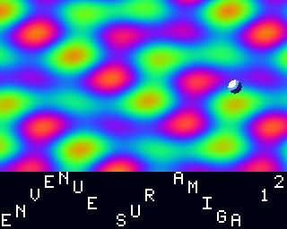

# Démos AGA — Amiga 1200 / AmigaOS 3.1+

Deux démos 68k **entièrement assemblables depuis Linux ou macOS**, écrites en
assembleur Motorola pour `vasm`, liées en exécutables *hunk* Amiga par `vlink`.

| Programme | Contenu |
|---|---|
| `bin/AGADemo` | dégradé plein écran généré **ligne par ligne par le copper en 24 bits réels**, plus une boule en **sprite matériel** |
| `bin/AGAScroll` | playfield **8 bitplanes (256 couleurs 24 bits)** de 640×384 pixels en **scrolling 100 % matériel**, plus un **scroller de texte sinusoïdal** au blitter dans une bande séparée |

Les deux jouent un **module ProTracker 4 voies sur Paula** et se quittent par
le bouton gauche de la souris.



*(image produite par `tools/preview.py`, un modèle Python du pipeline — voir
plus bas.)*

## Cible

| | |
|---|---|
| Machine | Amiga 1200 (chipset AGA), 68020+ |
| Système | AmigaOS 3.0 / 3.1 et supérieur (`graphics.library` V39) |
| Écran | PAL lores 320×256 |
| Mémoire | `AGADemo` : quelques Ko de Chip — `AGAScroll` : 240 Ko de Chip pour le bitmap, plus 8 Ko de copperlists ; le module (7,5 Ko) est en Chip dans les deux |
| Audio | 4 voies Paula, module ProTracker cadencé par le VBlank (50 Hz) |

## Compilation

```sh
make toolchain     # télécharge et compile vasm + vlink dans tools/bin (une fois)
make               # produit bin/AGADemo et bin/AGAScroll
```

`make toolchain` récupère les sources de Frank Wille
(<http://sun.hasenbraten.de/vasm/>, <http://sun.hasenbraten.de/vlink/>) et les
compile avec `gcc`. Si `vasmm68k_mot` et `vlink` sont déjà dans votre `PATH`,
`make` les utilise directement.

Régénérer les données (table sinus, pixels du sprite, palette 256 couleurs) :

```sh
make data          # Python 3, réécrit src/sine.i, src/sprite.i, src/palette.i
```

Régénérer la musique, ou l'écouter sans Amiga :

```sh
make music         # réécrit data/music.mod (samples et partition synthétisés)
make wav           # rejoue le module en Python et écrit music.wav
```

Vérifier l'arithmétique du scrolling et la disposition de la copperlist, et
produire un aperçu :

```sh
make check         # rejoue en Python les calculs du code 68k
make preview       # écrit docs/preview.png
```

## Exécution

- **FS-UAE / WinUAE** : configurez une A1200 (Kickstart 3.1, AGA, 68020, 2 Mo
  Chip), montez le dossier `bin/` comme disque dur, puis depuis le Shell :
  `AGADemo`.
- **Machine réelle** : copiez les exécutables et lancez-les **depuis un Shell**
  (ils ne gèrent pas le message `WBStartup` d'un lancement depuis le Workbench).

## Structure

```
src/demo.s       démo 1 : prise de contrôle, dégradé copper 24 bits, sprite
src/scroll.s     démo 2 : 8 bitplanes AGA + scrolling matériel
src/hardware.i   equates des registres custom et LVO exec/graphics
src/sine.i       table sinus 256 entrées                    (généré)
src/sprite.i     boule 16×16, 2 plans                       (généré)
src/palette.i    256 couleurs 24 bits (hauts / bas)         (généré)
src/font.i       police 16x16 pour le scrolltext             (généré)
src/ptreplay.i   replayer ProTracker 4 voies pour Paula
data/music.mod   module ProTracker, samples et partition     (généré)
tools/gen_data.py    générateur des quatre .i de données
tools/gen_module.py  générateur du module ProTracker
tools/render_mod.py  rejoue le module en Python et écrit un WAV
tools/preview.py     modèle Python du pipeline de scroll.s : contrôles + aperçu
scripts/get-toolchain.sh  installation de vasm + vlink
```

## Points techniques — `AGADemo`

**Prise de contrôle propre.** `OpenLibrary("graphics.library", 39)`,
`Forbid()`, `LoadView(NULL)` + deux `WaitTOF()`, `OwnBlitter()`, sauvegarde de
`INTENAR` / `DMACONR` et de `GfxBase->copinit`. À la sortie, tout est rendu :
copperlist système restaurée via `COP1LC` + strobe `COPJMP1`, DMA et
interruptions remis dans leur état, `DisownBlitter()`, `LoadView(ancienne vue)`,
`RethinkDisplay()`, `CloseLibrary()`, `Permit()`.

**Couleur 24 bits AGA.** Chaque ligne écrit `COLOR00` deux fois : d'abord avec
`BPLCON3` bit 9 (LOCT) à 0 pour les quartets de poids fort, puis avec LOCT à 1
pour les quartets de poids faible. On obtient 8 bits par composante au lieu des
4 bits de l'OCS/ECS — le dégradé est lisse, sans banding.

**Double buffer de copperlist.** Deux listes en Chip RAM : celle qui est
affichée et celle qu'on remplit. L'échange se fait en début de VBlank via
`COP1LC` puis un strobe sur `COPJMP1`, donc jamais de déchirure sur les
couleurs.

**Franchissement de la ligne 255.** Le comparateur vertical du copper est sur
8 bits : la liste insère la classique attente `$FFDF,$FFFE` avant de repartir
sur des positions verticales « enroulées ».

**Sprite matériel.** `SPR0POS` / `SPR0CTL` sont recalculés à chaque image
(VSTART, VSTOP, HSTART, plus les bits 8 de VSTART/VSTOP et le bit 0 de HSTART
placés dans SPR0CTL). Les canaux 1 à 7 pointent sur un sprite vide.
`BPLCON4 = $0011` garde la palette sprite historique (couleurs 16 à 31).

## Points techniques — `AGAScroll`

**8 bitplanes.** `BPLCON0` bit 4 (`BPU3`) à 1 et bits 14-12 à 0 : c'est le
codage AGA de « 8 plans ». En lores, 8 plans passent avec le fetch 16 bits
habituel (`FMODE = 0`), donc pas de contrainte d'alignement 32/64 bits ni de
bits de scroll étendus.

**256 couleurs en 24 bits.** Le copper charge la palette en 8 banques de 32
(`BPLCON3` bits 15-13), chaque banque écrite deux fois (LOCT = 0 puis 1) : 528
`MOVE`, soit environ 5 lignes de raster, largement avant le début de l'affichage
en ligne $2C.

**Scrolling matériel.** Aucun pixel n'est déplacé :
- *grossier* — les pointeurs `BPL1PT`…`BPL8PT` sont décalés de 2 octets par
  tranche de 16 pixels et de `BMWB` octets par ligne ; les modulos
  (`BPL1MOD`/`BPL2MOD` = 38) font sauter au DMA la partie non affichée ;
- *fin* — `BPLCON1` retarde le playfield de 0 à 15 pixels. Comme il faut de la
  matière à décaler, `DDFSTRT` recule de 8 color clocks ($30 au lieu de $38) :
  21 mots fetchés par ligne au lieu de 20.

La relation exacte, avec `W` le mot pointé et `d` le retard : le pixel affiché
en colonne 0 vaut `W*16 + 16 - d`. Pour afficher le pixel `X` de l'image, on
prend donc `W = (X-1)>>4` et `d = (-X) & 15`. `make check` rejoue ce calcul sur
les 256 images d'un cycle.

**Couleurs des sprites.** `BPLCON4 = $00FF` (ESPRM = OSPRM = $F) : les sprites
prennent leurs couleurs dans la banque $F, soit 241 à 243 — sinon ils
mangeraient les couleurs 17 à 19 de l'image. Les entrées 240 à 255 de la
palette sont d'ailleurs exclues de la rotation de couleurs.

**Double buffer de copperlist.** Chaque image, la liste cachée reçoit les 16
`MOVE` de pointeurs, le `MOVE` de `BPLCON1` et la palette tournée ; l'échange se
fait en début de VBlank.

**Génération du playfield.** Le plasma est calculé au démarrage (avant la prise
de contrôle de l'affichage, donc sous Workbench) par un chunky-to-planar par
paquets de 16 pixels, en deux passes de 4 plans : `lsr.b` sort le bit dans X,
`roxl.w` le récupère dans l'accumulateur du plan.

## Points techniques — scroller sinusoïdal

**Une bande à part, obtenue par un split copper.** À la ligne 236, le copper
repasse `BPLCON0` à un seul bitplane (`BPU = 1`), pointe `BPL1PT` sur le
bitmap du scroller, change le modulo et écrit ses propres `COLOR00`/`COLOR01`.
Rien n'est à restaurer ensuite : l'image suivante recharge tout depuis le haut
de la liste. Le playfield 8 plans occupe donc les lignes 44 à 235, la bande les
64 dernières.

**L'onde est fixe dans l'espace**, le texte la traverse : la hauteur d'un
caractère ne dépend que de son abscisse, `y = 24 + sin(2x + phase) × 24/128`.
C'est ce qui donne le mouvement classique — et cela impose de redessiner les
caractères à chaque image, contrairement à la variante « vague solidaire du
texte » qu'un simple scroll matériel suffirait à animer.

**Le blitter fait le travail.** Un blit d'effacement (canal D seul, minterme 0)
vide les 3 Ko de la bande, puis 22 blits de 16 lignes sur deux mots posent les
caractères visibles. Le décalage horizontal de 0 à 15 pixels est fait par le
barrel shifter du canal A — c'est pour cela que chaque ligne de glyphe occupe
deux mots dont le second est nul. Minterme `$FA` (`D = A OR C`) pour superposer
le glyphe au fond. Le tout tient largement dans le VBlank, ce qui compte :
pendant l'affichage, 8 bitplanes en lores ne laissent quasiment aucun créneau
DMA au blitter.

**La police** est une 5×7 doublée en 16×16, générée par `tools/gen_data.py`
avec sa table ASCII → glyphe. Le texte lui-même est en clair dans `scroll.s`,
donc modifiable sans rien régénérer.

## Points techniques — musique (`src/ptreplay.i`)

**Cadence.** `PT_Tick` est appelé une fois par image depuis la boucle
principale, juste après l'échange de copperlist : le VBlank sert d'horloge
(50 Hz), et `Fxx` règle le nombre de ticks par ligne (6 par défaut). Pas
d'interruption de niveau 3, donc pas de vecteur à installer ni de passage en
mode superviseur — en contrepartie, une image trop longue ralentirait la
musique.

**La séquence que Paula impose** pour lancer une note, et qui est la source
d'erreur classique :

1. couper le DMA du canal ;
2. écrire `AUDxLC`, `AUDxLEN`, `AUDxPER`, `AUDxVOL` ;
3. attendre deux lignes raster, le temps que Paula constate l'arrêt ;
4. relancer le DMA ;
5. **au tick suivant seulement**, écrire le point de boucle dans `AUDxLC` /
   `AUDxLEN` — Paula a alors déjà chargé l'adresse de départ, et rebouclera
   sur la boucle du sample.

**Le module doit être en Chip RAM** : `incbin` dans une section `DATA_C`, ce
que l'on vérifie sur le fichier lié (le hunk du module porte bien le drapeau
CHIP). Le filtre passe-bas est coupé au démarrage (`bset #1,$BFE001`, le bit
de la LED) et remis dans son état d'origine à la sortie.

**Effets implémentés** : `0xy` arpège, `1xx`/`2xx` portamento, `3xx`
portamento vers la note, `Axy` volume slide, `Cxx` volume, `Fxx` vitesse,
`Bxx` saut de position, `Dxx` break. Les autres sont ignorés, ainsi que le
finetune : c'est un sous-ensemble assumé, pas un replayer ProTracker complet.

**Le module est synthétisé** par `tools/gen_module.py` — samples (grosse
caisse, caisse claire, charleston, basse, lead, nappe) et partition en Am –
F – C – G. Rien n'est emprunté à un module existant, le dépôt reste libre de
droits.

## Ce qui est vérifié, et ce qui ne l'est pas

Les deux programmes s'assemblent et se lient (exécutables hunk valides, hunks
Chip correctement marqués), et `tools/preview.py` rejoue en Python la
disposition de la copperlist, les adresses patchées à chaque image, le
chunky-to-planar et le calcul de scroll — c'est ce modèle qui produit
`docs/preview.png` — bande de scrolltext comprise (position des caractères,
décalage du barrel shifter, débordements hors bande).

Côté musique, `tools/render_mod.py` rejoue le module avec exactement la même
sémantique que le replayer 68k (mêmes effets, même cadence 50 Hz, mêmes règles
de boucle) et produit un WAV : c'est ce qui vérifie le module et la logique de
rejeu.

En revanche **rien n'a encore tourné sur Amiga réel ni sous émulateur** : les
modèles valident l'arithmétique et la logique du code, pas le comportement du
chipset ni celui de Paula.

## Pistes pour la suite

- Scrolling infini : bitmap de la largeur de l'écran + 16 pixels, avec une
  colonne redessinée au blitter à chaque franchissement de mot.
- Étoiles ou barres copper dans la bande du scroller, derrière le texte.
- Blitter : effacement, dessin de bobs avec masque (cookie-cut), lignes.
- Interruption niveau 3 (VERTB / COPER) plutôt qu'une attente active.
- Cadencer le replayer par une interruption CIA-B (tempo BPM réel) plutôt que
  par le VBlank.
- Scroller sinusoïdal avec police 8×8 et copper text.
