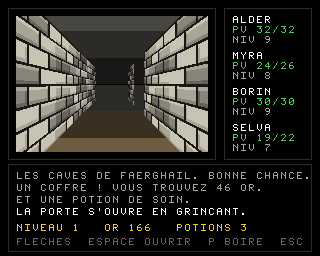

# Un jeu et deux démos AGA — Amiga 1200 / AmigaOS 3.1+

Trois programmes 68k **entièrement assemblables depuis Linux ou macOS**, écrits
en assembleur Motorola pour `vasm`, liés en exécutables *hunk* Amiga par
`vlink`.

| Programme | Contenu |
|---|---|
| `bin/AGACrawl` | **La Crypte de Faerghail** — dungeon crawler façon Black Crypt : création de groupe et règles inspirées de D&D 3.5, inventaire, magie, objets, niches, monstres animés, bruitages |
| `bin/AGADemo` | dégradé plein écran généré **ligne par ligne par le copper en 24 bits réels**, plus une boule en **sprite matériel** |
| `bin/AGAScroll` | playfield **8 bitplanes (256 couleurs 24 bits)** de 640×384 pixels en **scrolling 100 % matériel**, plus un **scroller de texte sinusoïdal** au blitter dans une bande séparée |

Tous jouent un **module ProTracker 4 voies sur Paula**. Les démos se quittent
par le bouton gauche de la souris, le jeu par ESC.




*(images produites par les modèles Python `tools/dungeon_preview.py` et
`tools/preview.py` — voir plus bas.)*

## Cible

| | |
|---|---|
| Machine | Amiga 1200 (chipset AGA), 68020+ |
| Système | AmigaOS 3.0 / 3.1 et supérieur (`graphics.library` V39) |
| Écran | PAL lores 320×256 |
| Mémoire | `AGADemo` : quelques Ko de Chip — `AGAScroll` : 240 Ko de Chip pour le bitmap, plus 8 Ko de copperlists ; le module (7,5 Ko) est en Chip dans les deux |
| Audio | 4 voies Paula, module ProTracker cadencé par le VBlank (50 Hz) |

## Compilation

```sh
make toolchain     # télécharge et compile vasm + vlink dans tools/bin (une fois)
make               # produit bin/AGADemo et bin/AGAScroll
```

`make toolchain` récupère les sources de Frank Wille
(<http://sun.hasenbraten.de/vasm/>, <http://sun.hasenbraten.de/vlink/>) et les
compile avec `gcc`. Si `vasmm68k_mot` et `vlink` sont déjà dans votre `PATH`,
`make` les utilise directement.

Régénérer les données (table sinus, pixels du sprite, palette 256 couleurs) :

```sh
make data          # Python 3, réécrit src/sine.i, src/sprite.i, src/palette.i
```

Régénérer la musique, ou l'écouter sans Amiga :

```sh
make music         # réécrit data/music.mod (samples et partition synthétisés)
make wav           # rejoue le module en Python et écrit music.wav
```

Régénérer les données du jeu, et en voir un écran :

```sh
make dungeon       # décors, cartes, police -- vérifie aussi que chaque
                   # niveau a son escalier atteignable depuis le départ
python3 tools/dungeon_preview.py 0 3 1 1 docs/crawl.png
python3 tools/dungeon_preview.py 0 3 1 1 combat.png 2   # ecran de combat
```

Vérifier l'arithmétique du scrolling et la disposition de la copperlist, et
produire un aperçu :

```sh
make check         # rejoue en Python les calculs du code 68k
make preview       # écrit docs/preview.png
```

## Disquette prête à l'emploi

`dist/AGADemos.adf` est une disquette 880 Ko **OFS amorçable** (DOS0, lisible
de Kickstart 1.3 à 3.x) contenant les trois exécutables, le source complet, le
module, un `Lisezmoi.txt` et un `S/Startup-Sequence` qui lance le jeu au
démarrage. `dist/AGADemos.lha` contient la même chose en archive LhA, pour un
transfert par réseau, CF ou Gotek plutôt que par disquette.

```sh
make disk          # refabrique les deux -- nécessite pip install amitools
```

- **Émulateur** : montez l'ADF dans DF0: et démarrez dessus.
- **Machine réelle** : écrivez l'ADF sur une disquette (ADF Blitzer,
  X-Copy + Amiga Explorer, Greaseweazle…), ou copiez le `.lha` sur le disque
  dur et faites `lha x AGADemos.lha`.

## Exécution

- **FS-UAE / WinUAE** : configurez une A1200 (Kickstart 3.1, AGA, 68020, 2 Mo
  Chip), montez le dossier `bin/` comme disque dur, puis depuis le Shell :
  `AGADemo`.
- **Machine réelle** : copiez les exécutables et lancez-les **depuis un Shell**
  (ils ne gèrent pas le message `WBStartup` d'un lancement depuis le Workbench).

## Structure

```
src/demo.s       démo 1 : prise de contrôle, dégradé copper 24 bits, sprite
src/scroll.s     démo 2 : 8 bitplanes AGA + scrolling matériel
src/hardware.i   equates des registres custom et LVO exec/graphics
src/sine.i       table sinus 256 entrées                    (généré)
src/sprite.i     boule 16×16, 2 plans                       (généré)
src/palette.i    256 couleurs 24 bits (hauts / bas)         (généré)
src/font.i       police 16x16 pour le scrolltext             (généré)
src/crawl.s      le jeu : moteur, rendu, combats, magie, interface
src/tables.i     objets, sorts, monstres, classes, noms          (généré)
data/sfx.bin     bruitages synthétisés                           (généré)
src/dgnpal.i     palette 16 couleurs du donjon               (généré)
src/font8.i      police 8x8 de l'interface                   (généré)
data/dgnart.bin  décors en perspective et monstres           (généré)
data/dgnmap.bin  les trois niveaux                           (généré)
src/ptreplay.i   replayer ProTracker 4 voies pour Paula
data/music.mod   module ProTracker, samples et partition     (généré)
tools/gen_data.py    générateur des quatre .i de données
tools/gen_module.py  générateur du module ProTracker
tools/gen_dungeon.py générateur des décors, des cartes et de la police 8x8
tools/gen_tables.py  générateur des tables du jeu
tools/gen_sfx.py     générateur des bruitages
tools/dungeon_preview.py rend un écran du jeu en PNG et contrôle les données
tools/render_mod.py  rejoue le module en Python et écrit un WAV
tools/preview.py     modèle Python du pipeline de scroll.s : contrôles + aperçu
tools/make_lha.py    écrit l'archive LhA (et se relit pour se vérifier)
tools/run68k.py      banc 68020 : charge l'exécutable, émule chipset et clavier
tools/test_game.py   fait tourner le jeu et contrôle ses invariants
tools/play_game.py   pilote le jeu vers les monstres, les objets, l'escalier
tools/shot68k.py     photographie les écrans dessinés par le processeur émulé
tools/test_sfx.py    vérifie les bruitages aux registres de Paula
tools/test_layout.py vérifie qu'aucun panneau ne déborde de la vue
tools/gen_score.py   générateur de la musique du jeu (data/crawlmus.mod)
disk/                fichiers écrits à la main pour la disquette
scripts/make-disk.sh fabrique l'ADF amorçable et le .lha
scripts/get-toolchain.sh  installation de vasm + vlink
```

## Le jeu — `AGACrawl`

Un crawler dans l'esprit de Black Crypt : on avance case par case, on tourne
de 90°, et le donjon est dessiné en vue subjective.

### Création du groupe

Quatre aventuriers, chacun d'une classe (guerrier, barbare, éclaireur, clerc)
qui décide du dé de vie, de la progression à l'attaque et de l'accès à la
magie. Les six caractéristiques sont tirées **à 4d6 en gardant les trois
meilleurs dés**, comme il se doit ; `R` relance, `ENTRÉE` valide. Le nom se
tape au clavier — et comme le CIA rend des **positions de touches**, pas des
caractères, `TAB` bascule entre AZERTY et QWERTY.

### Règles

Reprises du **SRD 3.5** (le contenu de D&D 3.5 publié sous Open Game
License) — les créatures « Product Identity » qui n'y figurent pas, comme le
beholder ou le flagelleur mental, sont donc absentes :

- **Modificateurs** : `(carac − 10) / 2`, arrondi vers le bas.
- **Classe d'armure** : `10 + mod. Dextérité + armure + bouclier`.
- **Attaque** : `1d20 + bonus de base + mod. Force` contre la CA du monstre.
  Le bonus de base suit le niveau chez les guerriers, les trois quarts
  ailleurs. Un 20 naturel touche toujours et **double les dégâts**.
- **Dégâts** : dés de l'arme + bonus magique + mod. Force. À l'arc, c'est la
  Dextérité qui sert à toucher.
- **Attaques multiples** : une attaque supplémentaire à −5 par tranche de 5
  points de bonus de base, comme la règle d'attaque à outrance.
- **Critiques par arme** : marge et multiplicateur du SRD (19-20/×2 pour les
  épées, ×3 pour les haches et l'arc), avec **jet de confirmation**.
- **Progression d'attaque** : complète, aux trois quarts ou de moitié selon la
  classe.
- **Sauvegardes** : Vigueur, Réflexes, Volonté — `2 + niveau/2` si la
  sauvegarde est forte pour la classe, `niveau/3` sinon, plus le modificateur
  de Constitution, Dextérité ou Sagesse.
- **Points de vie** : dé de classe maximal au niveau 1, puis un jet par
  niveau, plus le mod. Constitution.
- **Magie** : 16 sorts du SRD répartis sur les niveaux 0 à 3, avec
  **emplacements par niveau de sort** suivant la table de progression, plus
  les emplacements bonus de caractéristique. Le degré de difficulté vaut
  `10 + niveau du sort + mod. de lancement`, et les monstres y opposent leurs
  propres sauvegardes — réussie, une boule de feu n'inflige que la moitié des
  dégâts. Les sorts s'apprennent sur des **parchemins**.

### Les huit classes

Guerrier, barbare, roublard, rôdeur, paladin, clerc, magicien, ensorceleur —
chacune avec son dé de vie, sa progression d'attaque, ses sauvegardes fortes
et son type de lanceur (profane sur l'Intelligence, divin sur la Sagesse).

### Le bestiaire

25 créatures du SRD, avec leurs statistiques d'origine : kobold, gobelin, rat
sanguin, squelette, orc, hobgobelin, zombi, loup, gnoll, goule, bugbear, worg,
ombre, ogre, homme-lézard, gargouille, oursaloup, harpie, minotaure, troll,
spectre, momie, hydre, géant des collines… Chaque monstre tire ses points de
vie à ses dés de vie à l'apparition, et les rencontres sont réparties par
niveau de donjon selon leur facteur de puissance.

### Commandes

| Touche | Effet |
|---|---|
| Flèches | avancer, reculer, tourner |
| Espace | ouvrir une porte, fouiller une niche |
| C / I | fiche d'aventure, sac à dos |
| 1 à 4 | choisir le héros courant |
| A / S / F | attaquer, lancer un sort, fuir (en combat) |
| E / U / D | équiper, utiliser, jeter (dans le sac) |
| ESC | fermer un écran, puis quitter |

### Contenu

Trois niveaux, 28 objets (11 armes, 5 protections, potions, 6 parchemins,
clés, trésors), 4 monstres animés sur deux poses, coffres, objets au sol,
niches creusées dans les murs, portes ordinaires, portes verrouillées — et
une **porte à runes** par niveau, qui pose une énigme à trois réponses :
juste, elle s'efface et le groupe gagne de l'expérience ; faux, la rune brûle
un aventurier.

Le générateur **vérifie que chaque niveau reste finissable** : il place les
serrures loin du départ et les clés près, puis contrôle par parcours en
largeur qu'on atteint l'escalier ou au moins une clé sans forcer une serrure.
Ce contrôle a déjà attrapé un niveau coupé en deux dès la deuxième case.

### Rendu

Aucun calcul 3D à l'exécution : les murs sont pré-calculés en perspective par
`tools/gen_dungeon.py` — un morceau par position, y compris le fond et le mur
extérieur des passages latéraux — et posés au blitter du plus loin au plus
proche, en cookie-cut (minterme `$CA`) et **sans décalage**, puisque la
géométrie est fixe et chaque morceau calé sur un mot. Les murs latéraux se
projettent en droites passant par le point de fuite : à la colonne `x`, la
distance vaut `64/|96−x|`, ce qui donne un placage de texture exact. Les
dalles du sol et du plafond suivent la même règle. La pierre a son grain, ses
fissures et sa mousse, tirés d'un bruit stable.

Écran 320×256 en 4 bitplanes, palette chargée en 24 bits par le copper, double
tampon ; l'affichage n'est refait qu'après une action.

### Son

Le module ProTracker tourne sur trois voies ; la quatrième est **empruntée**
le temps d'un bruitage (épée, hache, arc, impact, esquive, porte, coffre,
potion, sort, rugissement, montée de niveau, pas, mort), le replayer laissant
le canal tranquille pendant la durée indiquée dans la table.

Le module perdait des tics pendant les déplacements : un redessin complet dure
plus qu'une image, et le tic n'était appelé qu'une fois par tour de boucle.
`MusicPoll`, semé dans les traitements longs, rejoue un tic dès qu'une image
s'est écoulée — le tempo tient désormais pendant le rendu.

## Points techniques — `AGADemo`

**Prise de contrôle propre.** `OpenLibrary("graphics.library", 39)`,
`Forbid()`, `LoadView(NULL)` + deux `WaitTOF()`, `OwnBlitter()`, sauvegarde de
`INTENAR` / `DMACONR` et de `GfxBase->copinit`. À la sortie, tout est rendu :
copperlist système restaurée via `COP1LC` + strobe `COPJMP1`, DMA et
interruptions remis dans leur état, `DisownBlitter()`, `LoadView(ancienne vue)`,
`RethinkDisplay()`, `CloseLibrary()`, `Permit()`.

**Couleur 24 bits AGA.** Chaque ligne écrit `COLOR00` deux fois : d'abord avec
`BPLCON3` bit 9 (LOCT) à 0 pour les quartets de poids fort, puis avec LOCT à 1
pour les quartets de poids faible. On obtient 8 bits par composante au lieu des
4 bits de l'OCS/ECS — le dégradé est lisse, sans banding.

**Double buffer de copperlist.** Deux listes en Chip RAM : celle qui est
affichée et celle qu'on remplit. L'échange se fait en début de VBlank via
`COP1LC` puis un strobe sur `COPJMP1`, donc jamais de déchirure sur les
couleurs.

**Franchissement de la ligne 255.** Le comparateur vertical du copper est sur
8 bits : la liste insère la classique attente `$FFDF,$FFFE` avant de repartir
sur des positions verticales « enroulées ».

**Sprite matériel.** `SPR0POS` / `SPR0CTL` sont recalculés à chaque image
(VSTART, VSTOP, HSTART, plus les bits 8 de VSTART/VSTOP et le bit 0 de HSTART
placés dans SPR0CTL). Les canaux 1 à 7 pointent sur un sprite vide.
`BPLCON4 = $0011` garde la palette sprite historique (couleurs 16 à 31).

## Points techniques — `AGAScroll`

**8 bitplanes.** `BPLCON0` bit 4 (`BPU3`) à 1 et bits 14-12 à 0 : c'est le
codage AGA de « 8 plans ». En lores, 8 plans passent avec le fetch 16 bits
habituel (`FMODE = 0`), donc pas de contrainte d'alignement 32/64 bits ni de
bits de scroll étendus.

**256 couleurs en 24 bits.** Le copper charge la palette en 8 banques de 32
(`BPLCON3` bits 15-13), chaque banque écrite deux fois (LOCT = 0 puis 1) : 528
`MOVE`, soit environ 5 lignes de raster, largement avant le début de l'affichage
en ligne $2C.

**Scrolling matériel.** Aucun pixel n'est déplacé :
- *grossier* — les pointeurs `BPL1PT`…`BPL8PT` sont décalés de 2 octets par
  tranche de 16 pixels et de `BMWB` octets par ligne ; les modulos
  (`BPL1MOD`/`BPL2MOD` = 38) font sauter au DMA la partie non affichée ;
- *fin* — `BPLCON1` retarde le playfield de 0 à 15 pixels. Comme il faut de la
  matière à décaler, `DDFSTRT` recule de 8 color clocks ($30 au lieu de $38) :
  21 mots fetchés par ligne au lieu de 20.

La relation exacte, avec `W` le mot pointé et `d` le retard : le pixel affiché
en colonne 0 vaut `W*16 + 16 - d`. Pour afficher le pixel `X` de l'image, on
prend donc `W = (X-1)>>4` et `d = (-X) & 15`. `make check` rejoue ce calcul sur
les 256 images d'un cycle.

**Couleurs des sprites.** `BPLCON4 = $00FF` (ESPRM = OSPRM = $F) : les sprites
prennent leurs couleurs dans la banque $F, soit 241 à 243 — sinon ils
mangeraient les couleurs 17 à 19 de l'image. Les entrées 240 à 255 de la
palette sont d'ailleurs exclues de la rotation de couleurs.

**Double buffer de copperlist.** Chaque image, la liste cachée reçoit les 16
`MOVE` de pointeurs, le `MOVE` de `BPLCON1` et la palette tournée ; l'échange se
fait en début de VBlank.

**Génération du playfield.** Le plasma est calculé au démarrage (avant la prise
de contrôle de l'affichage, donc sous Workbench) par un chunky-to-planar par
paquets de 16 pixels, en deux passes de 4 plans : `lsr.b` sort le bit dans X,
`roxl.w` le récupère dans l'accumulateur du plan.

## Points techniques — scroller sinusoïdal

**Une bande à part, obtenue par un split copper.** À la ligne 236, le copper
repasse `BPLCON0` à un seul bitplane (`BPU = 1`), pointe `BPL1PT` sur le
bitmap du scroller, change le modulo et écrit ses propres `COLOR00`/`COLOR01`.
Rien n'est à restaurer ensuite : l'image suivante recharge tout depuis le haut
de la liste. Le playfield 8 plans occupe donc les lignes 44 à 235, la bande les
64 dernières.

**L'onde est fixe dans l'espace**, le texte la traverse : la hauteur d'un
caractère ne dépend que de son abscisse, `y = 24 + sin(2x + phase) × 24/128`.
C'est ce qui donne le mouvement classique — et cela impose de redessiner les
caractères à chaque image, contrairement à la variante « vague solidaire du
texte » qu'un simple scroll matériel suffirait à animer.

**Le blitter fait le travail.** Un blit d'effacement (canal D seul, minterme 0)
vide les 3 Ko de la bande, puis 22 blits de 16 lignes sur deux mots posent les
caractères visibles. Le décalage horizontal de 0 à 15 pixels est fait par le
barrel shifter du canal A — c'est pour cela que chaque ligne de glyphe occupe
deux mots dont le second est nul. Minterme `$FA` (`D = A OR C`) pour superposer
le glyphe au fond. Le tout tient largement dans le VBlank, ce qui compte :
pendant l'affichage, 8 bitplanes en lores ne laissent quasiment aucun créneau
DMA au blitter.

**Les barres copper** derrière le texte sont trois dégradés (rouge, vert,
bleu) dont le centre suit un sinus à sa propre vitesse. `COLOR00` change à
chaque ligne de la bande — 64 blocs `WAIT` + deux écritures pour les 24 bits —
et les trois barres sont additionnées puis saturées, d'où le blanc à leurs
croisements. Le texte reste en couleur 1, donc lisible par-dessus.

**La police** est une 5×7 doublée en 16×16, générée par `tools/gen_data.py`
avec sa table ASCII → glyphe. Le texte lui-même est en clair dans `scroll.s`,
donc modifiable sans rien régénérer.

## Points techniques — musique (`src/ptreplay.i`)

**Cadence.** `PT_Tick` est appelé une fois par image depuis la boucle
principale, juste après l'échange de copperlist : le VBlank sert d'horloge
(50 Hz), et `Fxx` règle le nombre de ticks par ligne (6 par défaut). Pas
d'interruption de niveau 3, donc pas de vecteur à installer ni de passage en
mode superviseur — en contrepartie, une image trop longue ralentirait la
musique.

**La séquence que Paula impose** pour lancer une note, et qui est la source
d'erreur classique :

1. couper le DMA du canal ;
2. écrire `AUDxLC`, `AUDxLEN`, `AUDxPER`, `AUDxVOL` ;
3. attendre deux lignes raster, le temps que Paula constate l'arrêt ;
4. relancer le DMA ;
5. **au tick suivant seulement**, écrire le point de boucle dans `AUDxLC` /
   `AUDxLEN` — Paula a alors déjà chargé l'adresse de départ, et rebouclera
   sur la boucle du sample.

**Le module doit être en Chip RAM** : `incbin` dans une section `DATA_C`, ce
que l'on vérifie sur le fichier lié (le hunk du module porte bien le drapeau
CHIP). Le filtre passe-bas est coupé au démarrage (`bset #1,$BFE001`, le bit
de la LED) et remis dans son état d'origine à la sortie.

**Effets implémentés** : `0xy` arpège, `1xx`/`2xx` portamento, `3xx`
portamento vers la note, `Axy` volume slide, `Cxx` volume, `Fxx` vitesse,
`Bxx` saut de position, `Dxx` break. Les autres sont ignorés, ainsi que le
finetune : c'est un sous-ensemble assumé, pas un replayer ProTracker complet.

**Le module est synthétisé** par `tools/gen_module.py` — samples (grosse
caisse, caisse claire, charleston, basse, lead, nappe) et partition en Am –
F – C – G. Rien n'est emprunté à un module existant, le dépôt reste libre de
droits.

## Ce qui est vérifié, et ce qui ne l'est pas

Les deux programmes s'assemblent et se lient (exécutables hunk valides, hunks
Chip correctement marqués), et `tools/preview.py` rejoue en Python la
disposition de la copperlist, les adresses patchées à chaque image, le
chunky-to-planar et le calcul de scroll — c'est ce modèle qui produit
`docs/preview.png` — bande de scrolltext comprise (position des caractères,
décalage du barrel shifter, débordements hors bande).

Côté jeu, `tools/gen_dungeon.py` vérifie par parcours en largeur que
l'escalier de chaque niveau est atteignable depuis le départ — un donjon
injouable serait invisible à la relecture du code — et
`tools/dungeon_preview.py` rejoue l'algorithme d'affichage sur les vraies
données pour produire les captures ci-dessus.

Côté musique, `tools/render_mod.py` rejoue le module avec exactement la même
sémantique que le replayer 68k (mêmes effets, même cadence 50 Hz, mêmes règles
de boucle) et produit un WAV : c'est ce qui vérifie le module et la logique de
rejeu.

En revanche **rien n'a encore tourné sur Amiga réel ni sous émulateur** : les
modèles valident l'arithmétique et la logique du code, pas le comportement du
chipset ni celui de Paula.

## Pistes pour la suite

- Scrolling infini : bitmap de la largeur de l'écran + 16 pixels, avec une
  colonne redessinée au blitter à chaque franchissement de mot.
- Blitter : effacement, dessin de bobs avec masque (cookie-cut), lignes.
- Interruption niveau 3 (VERTB / COPER) plutôt qu'une attente active.
- Cadencer le replayer par une interruption CIA-B (tempo BPM réel) plutôt que
  par le VBlank.
- Scroller sinusoïdal avec police 8×8 et copper text.
